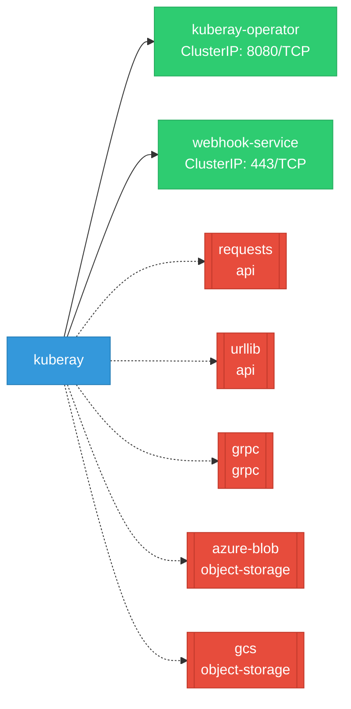

# kuberay: Network

## Service Map

### Services

| Name | Type | Ports | Source |
|------|------|-------|--------|
| kuberay-operator | ClusterIP | 8080/TCP | [`ray-operator/config/manager/service.yaml`](https://github.com/ray-project/kuberay/blob/92bd061228ae1b70c7d34858ac1efaf6f271f0db/ray-operator/config/manager/service.yaml) |
| webhook-service | ClusterIP | 443/TCP | [`ray-operator/config/webhook/service.yaml`](https://github.com/ray-project/kuberay/blob/92bd061228ae1b70c7d34858ac1efaf6f271f0db/ray-operator/config/webhook/service.yaml) |

!!! warning "No Network Policies"
    No NetworkPolicy resources were found in the analyzed sources. Network policies may exist in overlays, Helm values, or cluster-level configurations not captured by static analysis.

