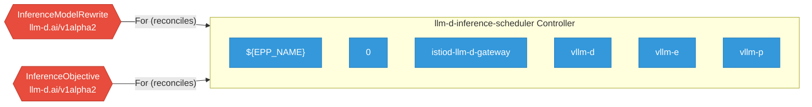

# llm-d-inference-scheduler

> **Architecture snapshot: 2026-09-07** (2026-09-07)

**Repository:** llm-d/llm-d-inference-scheduler  
**Analyzer:** arch-analyzer dev  
**Extracted:** 2026-09-07T04:01:17Z

## Summary

| Metric | Count |
|--------|-------|
| CRDs | 2 |
| Deployments | 6 |
| Services | 7 |
| Secrets | 3 |
| Cluster Roles | 0 |
| Controller Watches | 4 |

## Component Architecture

CRDs, controllers, and owned Kubernetes resources.

### CRDs

| Group | Version | Kind | Scope | Fields | Validation Rules | Discovery | Source |
|-------|---------|------|-------|--------|------------------|-----------|--------|
| llm-d.ai | v1alpha2 | InferenceModelRewrite | Namespaced | 24 | 0 | YAML + Go AST | [`config/crd/bases/llm-d.ai_inferencemodelrewrites.yaml`](https://github.com/llm-d/llm-d-inference-scheduler/blob/93b81aa4c54829fc7348d4e84830bd01c40338e0/config/crd/bases/llm-d.ai_inferencemodelrewrites.yaml) |
| llm-d.ai | v1alpha2 | InferenceObjective | Namespaced | 17 | 0 | YAML + Go AST | [`config/crd/bases/llm-d.ai_inferenceobjectives.yaml`](https://github.com/llm-d/llm-d-inference-scheduler/blob/93b81aa4c54829fc7348d4e84830bd01c40338e0/config/crd/bases/llm-d.ai_inferenceobjectives.yaml) |

## Dependencies

### Key External Dependencies

| Module | Version |
|--------|---------|
| github.com/go-logr/logr | v1.4.3 |
| github.com/go-logr/stdr | v1.2.2 |
| github.com/go-logr/zapr | v1.3.0 |
| github.com/prometheus/client_golang | v1.23.2 |
| github.com/prometheus/client_model | v0.6.2 |
| github.com/prometheus/common | v0.67.5 |
| google.golang.org/grpc | v1.81.1 |
| k8s.io/api | v0.35.6 |
| k8s.io/apiextensions-apiserver | v0.35.6 |
| k8s.io/apimachinery | v0.35.6 |
| k8s.io/client-go | v0.35.6 |
| sigs.k8s.io/controller-runtime | v0.23.3 |

