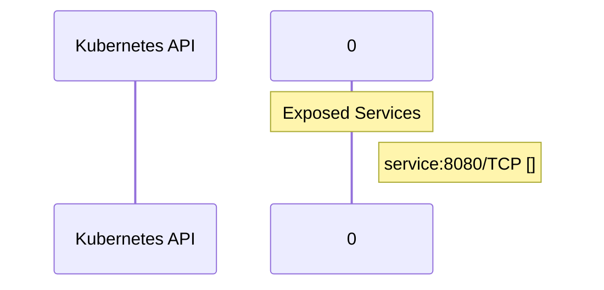

# llm-d-routing-sidecar: Dataflow

## Controller Watches

Kubernetes resources this controller monitors for changes. Each watch triggers reconciliation when the watched resource is created, updated, or deleted.

No controller watches found in analyzed sources.

## Reconciliation Flow

How the controller interacts with the Kubernetes API during reconciliation.

### HTTP Endpoints

| Method | Path | Source |
|--------|------|--------|
| * | / | [`internal/proxy/proxy.go:275`](https://github.com/llm-d/llm-d-routing-sidecar/blob/214ed72b3bcd2ea0d66ae2f15d82e0037a726c06/internal/proxy/proxy.go#L275) |
| * | GET /health | [`internal/proxy/proxy.go:239`](https://github.com/llm-d/llm-d-routing-sidecar/blob/214ed72b3bcd2ea0d66ae2f15d82e0037a726c06/internal/proxy/proxy.go#L239) |
| * | POST  | [`internal/proxy/proxy.go:242`](https://github.com/llm-d/llm-d-routing-sidecar/blob/214ed72b3bcd2ea0d66ae2f15d82e0037a726c06/internal/proxy/proxy.go#L242) |
| * | POST  | [`internal/proxy/proxy.go:243`](https://github.com/llm-d/llm-d-routing-sidecar/blob/214ed72b3bcd2ea0d66ae2f15d82e0037a726c06/internal/proxy/proxy.go#L243) |

## Configuration

ConfigMaps and Helm values that control this component's runtime behavior.

