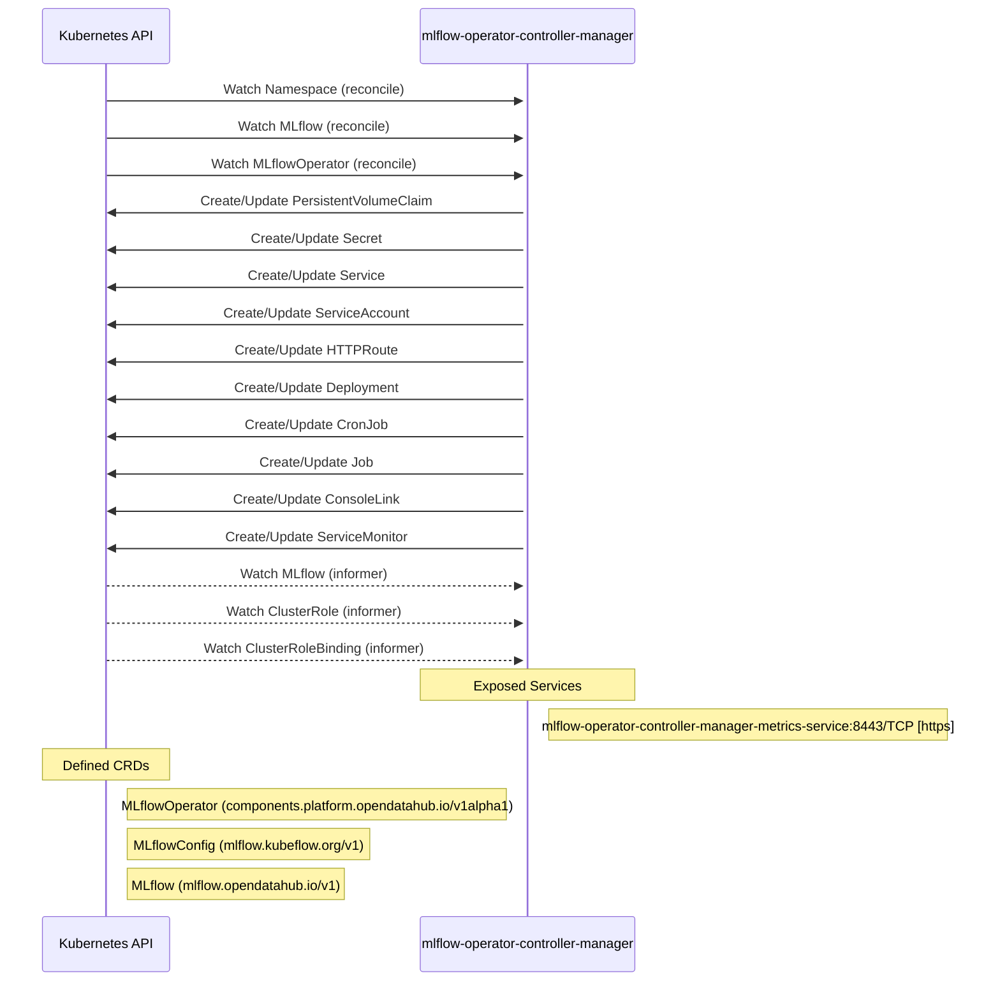

# mlflow-operator: Dataflow

## Controller Watches

Kubernetes resources this controller monitors for changes. Each watch triggers reconciliation when the watched resource is created, updated, or deleted.

| Type | GVK | Source |
|------|-----|--------|
| For | /v1/Namespace | [`internal/controller/namespace_rbac_controller.go:92`](https://github.com/opendatahub-io/mlflow-operator/blob/e7010bc04ff675ba5dcccaf88a939f5c5c53fd79/internal/controller/namespace_rbac_controller.go#L92) |
| For | api/v1/MLflow | [`internal/controller/mlflow_controller.go:472`](https://github.com/opendatahub-io/mlflow-operator/blob/e7010bc04ff675ba5dcccaf88a939f5c5c53fd79/internal/controller/mlflow_controller.go#L472) |
| For | mlflowoperator/v1alpha1/MLflowOperator | [`internal/controller/mlflowoperator_controller.go:134`](https://github.com/opendatahub-io/mlflow-operator/blob/e7010bc04ff675ba5dcccaf88a939f5c5c53fd79/internal/controller/mlflowoperator_controller.go#L134) |
| Owns | /v1/PersistentVolumeClaim | [`internal/controller/mlflow_controller.go:479`](https://github.com/opendatahub-io/mlflow-operator/blob/e7010bc04ff675ba5dcccaf88a939f5c5c53fd79/internal/controller/mlflow_controller.go#L479) |
| Owns | /v1/Secret | [`internal/controller/mlflow_controller.go:476`](https://github.com/opendatahub-io/mlflow-operator/blob/e7010bc04ff675ba5dcccaf88a939f5c5c53fd79/internal/controller/mlflow_controller.go#L476) |
| Owns | /v1/Service | [`internal/controller/mlflow_controller.go:477`](https://github.com/opendatahub-io/mlflow-operator/blob/e7010bc04ff675ba5dcccaf88a939f5c5c53fd79/internal/controller/mlflow_controller.go#L477) |
| Owns | /v1/ServiceAccount | [`internal/controller/mlflow_controller.go:478`](https://github.com/opendatahub-io/mlflow-operator/blob/e7010bc04ff675ba5dcccaf88a939f5c5c53fd79/internal/controller/mlflow_controller.go#L478) |
| Owns | apis/v1/HTTPRoute | [`internal/controller/mlflow_controller.go:538`](https://github.com/opendatahub-io/mlflow-operator/blob/e7010bc04ff675ba5dcccaf88a939f5c5c53fd79/internal/controller/mlflow_controller.go#L538) |
| Owns | apps/v1/Deployment | [`internal/controller/mlflow_controller.go:473`](https://github.com/opendatahub-io/mlflow-operator/blob/e7010bc04ff675ba5dcccaf88a939f5c5c53fd79/internal/controller/mlflow_controller.go#L473) |
| Owns | batch/v1/CronJob | [`internal/controller/mlflow_controller.go:475`](https://github.com/opendatahub-io/mlflow-operator/blob/e7010bc04ff675ba5dcccaf88a939f5c5c53fd79/internal/controller/mlflow_controller.go#L475) |
| Owns | batch/v1/Job | [`internal/controller/mlflow_controller.go:474`](https://github.com/opendatahub-io/mlflow-operator/blob/e7010bc04ff675ba5dcccaf88a939f5c5c53fd79/internal/controller/mlflow_controller.go#L474) |
| Owns | console/v1/ConsoleLink | [`internal/controller/mlflow_controller.go:530`](https://github.com/opendatahub-io/mlflow-operator/blob/e7010bc04ff675ba5dcccaf88a939f5c5c53fd79/internal/controller/mlflow_controller.go#L530) |
| Owns | monitoring/v1/ServiceMonitor | [`internal/controller/mlflow_controller.go:546`](https://github.com/opendatahub-io/mlflow-operator/blob/e7010bc04ff675ba5dcccaf88a939f5c5c53fd79/internal/controller/mlflow_controller.go#L546) |
| Watches | api/v1/MLflow | [`internal/controller/namespace_rbac_controller.go:101`](https://github.com/opendatahub-io/mlflow-operator/blob/e7010bc04ff675ba5dcccaf88a939f5c5c53fd79/internal/controller/namespace_rbac_controller.go#L101) |
| Watches | rbac.authorization.k8s.io/v1/ClusterRole | [`internal/controller/mlflow_controller.go:484`](https://github.com/opendatahub-io/mlflow-operator/blob/e7010bc04ff675ba5dcccaf88a939f5c5c53fd79/internal/controller/mlflow_controller.go#L484) |
| Watches | rbac.authorization.k8s.io/v1/ClusterRoleBinding | [`internal/controller/mlflow_controller.go:485`](https://github.com/opendatahub-io/mlflow-operator/blob/e7010bc04ff675ba5dcccaf88a939f5c5c53fd79/internal/controller/mlflow_controller.go#L485) |

### Programmatic Resource Operations

| Verb | Kind | Group | Condition |
|------|------|-------|----------|
| update | MLflow | api |  |
| update | MLflowOperator | mlflowoperator |  |

## Reconciliation Flow

How the controller interacts with the Kubernetes API during reconciliation.

## Configuration

ConfigMaps and Helm values that control this component's runtime behavior.

### Helm

**Chart:** mlflow v0.1.0

