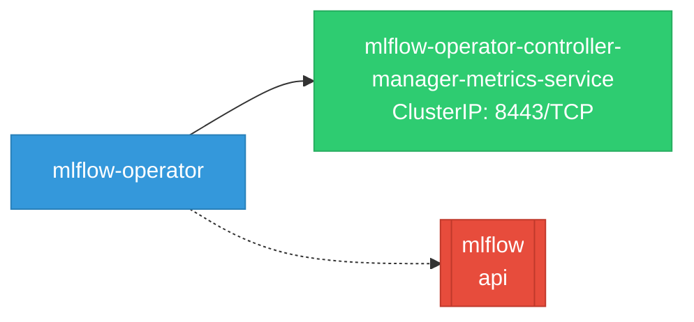

# mlflow-operator: Network

## Service Map

### Services

| Name | Type | Ports | Source |
|------|------|-------|--------|
| mlflow-operator-controller-manager-metrics-service | ClusterIP | 8443/TCP | [`kustomize:config/overlays/odh`](https://github.com/opendatahub-io/mlflow-operator/blob/e7010bc04ff675ba5dcccaf88a939f5c5c53fd79/kustomize:config/overlays/odh) |

### Ingress / Routing

| Kind | Name | Hosts | Paths | TLS | Source |
|------|------|-------|-------|-----|--------|
| HTTPRoute | rbac-inferred |  |  | no | [`rbac/manager-role`](https://github.com/opendatahub-io/mlflow-operator/blob/e7010bc04ff675ba5dcccaf88a939f5c5c53fd79/rbac/manager-role) |

!!! warning "No Network Policies"
    No NetworkPolicy resources were found in the analyzed sources. Network policies may exist in overlays, Helm values, or cluster-level configurations not captured by static analysis.

