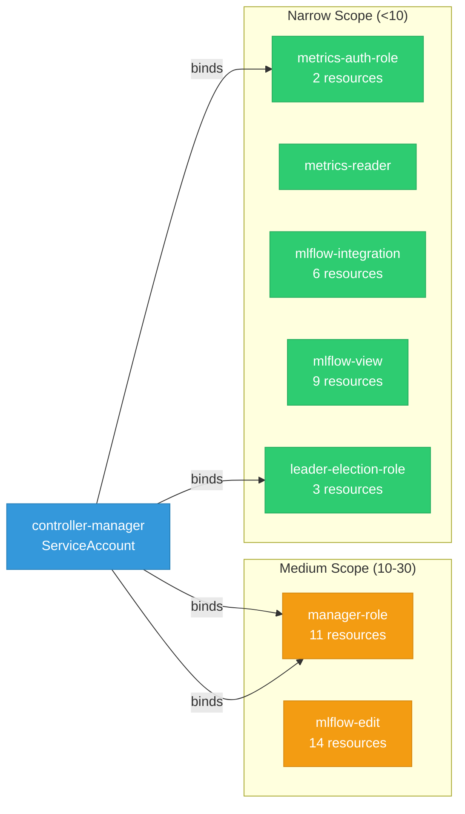

# mlflow-operator: RBAC

ServiceAccount bindings, roles, and resource permissions.

## RBAC Overview

This component defines a large RBAC surface (153 diagram lines). The graph below groups roles by permission scope.

## Bindings

Subject-to-role mappings defining who has access to what.

| Binding | Type | Role | Subject |
|---------|------|------|---------|
| manager-rolebinding | ClusterRoleBinding | manager-role | ServiceAccount/controller-manager |
| metrics-auth-rolebinding | ClusterRoleBinding | metrics-auth-role | ServiceAccount/controller-manager |
| leader-election-rolebinding | RoleBinding | leader-election-role | ServiceAccount/controller-manager |
| manager-rolebinding | RoleBinding | manager-role | ServiceAccount/controller-manager |

## Role Details

Per-rule breakdown of API groups, resources, and verbs for each role.

| Role | Kind | API Groups | Resources | Verbs |
|------|------|------------|-----------|-------|
| manager-role | ClusterRole |  | namespaces | get, list, watch |
| manager-role | ClusterRole |  | secrets | get, list, watch |
| manager-role | ClusterRole |  | mlflowoperators | get, list, patch, update, watch |
| manager-role | ClusterRole |  | mlflowoperators/finalizers | update |
| manager-role | ClusterRole |  | mlflowoperators/status | get, patch, update |
| manager-role | ClusterRole |  | consolelinks | create, delete, get, list, patch, update, watch |
| manager-role | ClusterRole |  | httproutes | create, delete, get, list, patch, update, watch |
| manager-role | ClusterRole |  | mlflowconfigs | get, list, watch |
| manager-role | ClusterRole |  | mlflows | create, delete, get, list, patch, update, watch |
| manager-role | ClusterRole |  | mlflows/finalizers | update |
| manager-role | ClusterRole |  | mlflows/status | get, patch, update |
| manager-role | ClusterRole |  | clusterrolebindings, clusterroles | delete, get, list, patch, update, watch |
| manager-role | ClusterRole |  | clusterrolebindings, clusterroles | delete, list, patch, update, watch |
| manager-role | ClusterRole |  | clusterrolebindings, clusterroles, rolebindings | create |
| manager-role | ClusterRole |  | clusterroles | bind |
| manager-role | ClusterRole |  | rolebindings | delete, get, list, patch, update, watch |
| manager-role | ClusterRole |  | auths | get, list, watch |
| metrics-auth-role | ClusterRole |  | tokenreviews | create |
| metrics-auth-role | ClusterRole |  | subjectaccessreviews | create |
| metrics-reader | ClusterRole |  |  | get |
| mlflow-edit | ClusterRole |  | mlflows | get, list, watch, create, delete, deletecollection, patch, update |
| mlflow-edit | ClusterRole |  | mlflows/finalizers | patch, update |
| mlflow-edit | ClusterRole |  | mlflowconfigs | create, delete, deletecollection, patch, update |
| mlflow-edit | ClusterRole |  | gatewaysecrets | get, list |
| mlflow-edit | ClusterRole |  | datasets, experiments, registeredmodels, gatewaysecrets, gatewayendpoints, gatewaymodeldefinitions, mcpservers | create, update, delete |
| mlflow-edit | ClusterRole |  | gatewaysecrets/use, gatewayendpoints/use, gatewaymodeldefinitions/use | create |
| mlflow-integration | ClusterRole |  | datasets, experiments, registeredmodels | get, list, create, update |
| mlflow-integration | ClusterRole |  | gatewayendpoints | get, list |
| mlflow-integration | ClusterRole |  | mcpservers | get, list |
| mlflow-integration | ClusterRole |  | gatewayendpoints/use | create |
| mlflow-view | ClusterRole |  | mlflows | get, list, watch |
| mlflow-view | ClusterRole |  | mlflowconfigs | get, list, watch |
| mlflow-view | ClusterRole |  | mlflows/status | get, list, watch |
| mlflow-view | ClusterRole |  | datasets, experiments, registeredmodels, gatewayendpoints, gatewaymodeldefinitions, mcpservers | get, list |
| leader-election-role | Role |  | configmaps | get, list, watch, create, update, patch, delete |
| leader-election-role | Role |  | leases | get, list, watch, create, update, patch, delete |
| leader-election-role | Role |  | events | create, patch |
| manager-role | Role |  | configmaps, persistentvolumeclaims, secrets, serviceaccounts, services | create, delete, get, list, patch, update, watch |
| manager-role | Role |  | pods | get, list, watch |
| manager-role | Role |  | deployments | create, delete, get, list, patch, update, watch |
| manager-role | Role |  | jobs, cronjobs | create, delete, get, list, patch, update, watch |
| manager-role | Role |  | networkpolicies | create, delete, get, list, patch, update, watch |
| manager-role | Role |  | servicemonitors | create, delete, get, list, patch, update, watch |

