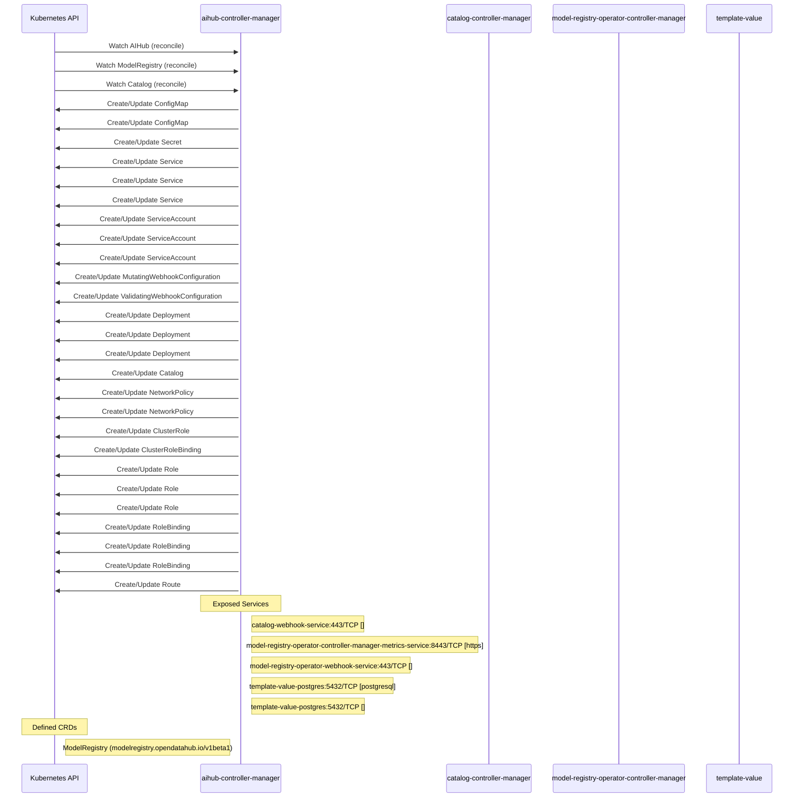

# model-registry-operator: Dataflow

## Controller Watches

Kubernetes resources this controller monitors for changes. Each watch triggers reconciliation when the watched resource is created, updated, or deleted.

| Type | GVK | Source |
|------|-----|--------|
| For | aihub/v1alpha1/AIHub | [`internal/controller/aihub_controller.go:767`](https://github.com/opendatahub-io/model-registry-operator/blob/1207a6416b6cd625ffdfd6b4bfb0e08a1fa9584d/internal/controller/aihub_controller.go#L767) |
| For | api/v1beta1/ModelRegistry | [`internal/controller/modelregistry_controller.go:282`](https://github.com/opendatahub-io/model-registry-operator/blob/1207a6416b6cd625ffdfd6b4bfb0e08a1fa9584d/internal/controller/modelregistry_controller.go#L282) |
| For | catalog/v1alpha1/Catalog | [`internal/controller/catalog_controller.go:1472`](https://github.com/opendatahub-io/model-registry-operator/blob/1207a6416b6cd625ffdfd6b4bfb0e08a1fa9584d/internal/controller/catalog_controller.go#L1472) |
| Owns | /v1/ConfigMap | [`internal/controller/aihub_controller.go:771`](https://github.com/opendatahub-io/model-registry-operator/blob/1207a6416b6cd625ffdfd6b4bfb0e08a1fa9584d/internal/controller/aihub_controller.go#L771) |
| Owns | /v1/ConfigMap | [`internal/controller/catalog_controller.go:1476`](https://github.com/opendatahub-io/model-registry-operator/blob/1207a6416b6cd625ffdfd6b4bfb0e08a1fa9584d/internal/controller/catalog_controller.go#L1476) |
| Owns | /v1/Secret | [`internal/controller/catalog_controller.go:1477`](https://github.com/opendatahub-io/model-registry-operator/blob/1207a6416b6cd625ffdfd6b4bfb0e08a1fa9584d/internal/controller/catalog_controller.go#L1477) |
| Owns | /v1/Service | [`internal/controller/modelregistry_controller.go:283`](https://github.com/opendatahub-io/model-registry-operator/blob/1207a6416b6cd625ffdfd6b4bfb0e08a1fa9584d/internal/controller/modelregistry_controller.go#L283) |
| Owns | /v1/Service | [`internal/controller/aihub_controller.go:769`](https://github.com/opendatahub-io/model-registry-operator/blob/1207a6416b6cd625ffdfd6b4bfb0e08a1fa9584d/internal/controller/aihub_controller.go#L769) |
| Owns | /v1/Service | [`internal/controller/catalog_controller.go:1474`](https://github.com/opendatahub-io/model-registry-operator/blob/1207a6416b6cd625ffdfd6b4bfb0e08a1fa9584d/internal/controller/catalog_controller.go#L1474) |
| Owns | /v1/ServiceAccount | [`internal/controller/aihub_controller.go:770`](https://github.com/opendatahub-io/model-registry-operator/blob/1207a6416b6cd625ffdfd6b4bfb0e08a1fa9584d/internal/controller/aihub_controller.go#L770) |
| Owns | /v1/ServiceAccount | [`internal/controller/modelregistry_controller.go:284`](https://github.com/opendatahub-io/model-registry-operator/blob/1207a6416b6cd625ffdfd6b4bfb0e08a1fa9584d/internal/controller/modelregistry_controller.go#L284) |
| Owns | /v1/ServiceAccount | [`internal/controller/catalog_controller.go:1475`](https://github.com/opendatahub-io/model-registry-operator/blob/1207a6416b6cd625ffdfd6b4bfb0e08a1fa9584d/internal/controller/catalog_controller.go#L1475) |
| Owns | admissionregistration.k8s.io/v1/MutatingWebhookConfiguration | [`internal/controller/aihub_controller.go:777`](https://github.com/opendatahub-io/model-registry-operator/blob/1207a6416b6cd625ffdfd6b4bfb0e08a1fa9584d/internal/controller/aihub_controller.go#L777) |
| Owns | admissionregistration.k8s.io/v1/ValidatingWebhookConfiguration | [`internal/controller/aihub_controller.go:776`](https://github.com/opendatahub-io/model-registry-operator/blob/1207a6416b6cd625ffdfd6b4bfb0e08a1fa9584d/internal/controller/aihub_controller.go#L776) |
| Owns | apps/v1/Deployment | [`internal/controller/catalog_controller.go:1473`](https://github.com/opendatahub-io/model-registry-operator/blob/1207a6416b6cd625ffdfd6b4bfb0e08a1fa9584d/internal/controller/catalog_controller.go#L1473) |
| Owns | apps/v1/Deployment | [`internal/controller/modelregistry_controller.go:285`](https://github.com/opendatahub-io/model-registry-operator/blob/1207a6416b6cd625ffdfd6b4bfb0e08a1fa9584d/internal/controller/modelregistry_controller.go#L285) |
| Owns | apps/v1/Deployment | [`internal/controller/aihub_controller.go:768`](https://github.com/opendatahub-io/model-registry-operator/blob/1207a6416b6cd625ffdfd6b4bfb0e08a1fa9584d/internal/controller/aihub_controller.go#L768) |
| Owns | catalog/v1alpha1/Catalog | [`internal/controller/aihub_controller.go:778`](https://github.com/opendatahub-io/model-registry-operator/blob/1207a6416b6cd625ffdfd6b4bfb0e08a1fa9584d/internal/controller/aihub_controller.go#L778) |
| Owns | networking.k8s.io/v1/NetworkPolicy | [`internal/controller/modelregistry_controller.go:287`](https://github.com/opendatahub-io/model-registry-operator/blob/1207a6416b6cd625ffdfd6b4bfb0e08a1fa9584d/internal/controller/modelregistry_controller.go#L287) |
| Owns | networking.k8s.io/v1/NetworkPolicy | [`internal/controller/catalog_controller.go:1478`](https://github.com/opendatahub-io/model-registry-operator/blob/1207a6416b6cd625ffdfd6b4bfb0e08a1fa9584d/internal/controller/catalog_controller.go#L1478) |
| Owns | rbac.authorization.k8s.io/v1/ClusterRole | [`internal/controller/aihub_controller.go:774`](https://github.com/opendatahub-io/model-registry-operator/blob/1207a6416b6cd625ffdfd6b4bfb0e08a1fa9584d/internal/controller/aihub_controller.go#L774) |
| Owns | rbac.authorization.k8s.io/v1/ClusterRoleBinding | [`internal/controller/aihub_controller.go:775`](https://github.com/opendatahub-io/model-registry-operator/blob/1207a6416b6cd625ffdfd6b4bfb0e08a1fa9584d/internal/controller/aihub_controller.go#L775) |
| Owns | rbac.authorization.k8s.io/v1/Role | [`internal/controller/catalog_controller.go:1479`](https://github.com/opendatahub-io/model-registry-operator/blob/1207a6416b6cd625ffdfd6b4bfb0e08a1fa9584d/internal/controller/catalog_controller.go#L1479) |
| Owns | rbac.authorization.k8s.io/v1/Role | [`internal/controller/modelregistry_controller.go:286`](https://github.com/opendatahub-io/model-registry-operator/blob/1207a6416b6cd625ffdfd6b4bfb0e08a1fa9584d/internal/controller/modelregistry_controller.go#L286) |
| Owns | rbac.authorization.k8s.io/v1/Role | [`internal/controller/aihub_controller.go:772`](https://github.com/opendatahub-io/model-registry-operator/blob/1207a6416b6cd625ffdfd6b4bfb0e08a1fa9584d/internal/controller/aihub_controller.go#L772) |
| Owns | rbac.authorization.k8s.io/v1/RoleBinding | [`internal/controller/catalog_controller.go:1480`](https://github.com/opendatahub-io/model-registry-operator/blob/1207a6416b6cd625ffdfd6b4bfb0e08a1fa9584d/internal/controller/catalog_controller.go#L1480) |
| Owns | rbac.authorization.k8s.io/v1/RoleBinding | [`internal/controller/aihub_controller.go:773`](https://github.com/opendatahub-io/model-registry-operator/blob/1207a6416b6cd625ffdfd6b4bfb0e08a1fa9584d/internal/controller/aihub_controller.go#L773) |
| Owns | rbac.authorization.k8s.io/v1/RoleBinding | [`internal/controller/modelregistry_controller.go:289`](https://github.com/opendatahub-io/model-registry-operator/blob/1207a6416b6cd625ffdfd6b4bfb0e08a1fa9584d/internal/controller/modelregistry_controller.go#L289) |
| Owns | route/v1/Route | [`internal/controller/catalog_controller.go:1483`](https://github.com/opendatahub-io/model-registry-operator/blob/1207a6416b6cd625ffdfd6b4bfb0e08a1fa9584d/internal/controller/catalog_controller.go#L1483) |

### Programmatic Resource Operations

| Verb | Kind | Group | Condition |
|------|------|-------|----------|
| update | AIHub | aihub |  |
| delete | Deployment | apps |  |
| update | Catalog | catalog |  |
| update | ModelRegistry | api |  |

## Reconciliation Flow

How the controller interacts with the Kubernetes API during reconciliation.

### Webhooks

| Name | Type | Path | Failure Policy | Service | Overlays | Enable Condition | Sources |
|------|------|------|----------------|---------|----------|------------------|----------|
| conversion-unknown | conversion | /convert |  | system/webhook-service |  |  | [`config/crd/patches/webhook_in_modelregistries.yaml`](https://github.com/opendatahub-io/model-registry-operator/blob/1207a6416b6cd625ffdfd6b4bfb0e08a1fa9584d/config/crd/patches/webhook_in_modelregistries.yaml) |
| mmodelregistry.opendatahub.io | mutating | /mutate-modelregistry-opendatahub-io-modelregistry | Fail | opendatahub/model-registry-operator-webhook-service | config/overlays/odh |  | [`config/webhook/manifests.yaml`](https://github.com/opendatahub-io/model-registry-operator/blob/1207a6416b6cd625ffdfd6b4bfb0e08a1fa9584d/config/webhook/manifests.yaml), [`kustomize:config/overlays/odh (model-registry-operator-mutating-webhook-configuration)`](https://github.com/opendatahub-io/model-registry-operator/blob/1207a6416b6cd625ffdfd6b4bfb0e08a1fa9584d/kustomize:config/overlays/odh %28model-registry-operator-mutating-webhook-configuration%29), [`internal/webhook/modelregistry_webhook.go`](https://github.com/opendatahub-io/model-registry-operator/blob/1207a6416b6cd625ffdfd6b4bfb0e08a1fa9584d/internal/webhook/modelregistry_webhook.go) |
| vcatalog.aihub.opendatahub.io | validating | /validate-aihub-opendatahub-io-catalog | Fail | opendatahub/catalog-webhook-service | config/overlays/odh |  | [`config/overlays/catalog/webhook.yaml`](https://github.com/opendatahub-io/model-registry-operator/blob/1207a6416b6cd625ffdfd6b4bfb0e08a1fa9584d/config/overlays/catalog/webhook.yaml), [`kustomize:config/overlays/odh (catalog-validating-webhook-configuration)`](https://github.com/opendatahub-io/model-registry-operator/blob/1207a6416b6cd625ffdfd6b4bfb0e08a1fa9584d/kustomize:config/overlays/odh %28catalog-validating-webhook-configuration%29), [`internal/webhook/catalog_webhook.go`](https://github.com/opendatahub-io/model-registry-operator/blob/1207a6416b6cd625ffdfd6b4bfb0e08a1fa9584d/internal/webhook/catalog_webhook.go) |
| vmodelregistry.opendatahub.io | validating | /validate-modelregistry-opendatahub-io-modelregistry | Fail | opendatahub/model-registry-operator-webhook-service | config/overlays/odh |  | [`config/webhook/manifests.yaml`](https://github.com/opendatahub-io/model-registry-operator/blob/1207a6416b6cd625ffdfd6b4bfb0e08a1fa9584d/config/webhook/manifests.yaml), [`kustomize:config/overlays/odh (model-registry-operator-validating-webhook-configuration)`](https://github.com/opendatahub-io/model-registry-operator/blob/1207a6416b6cd625ffdfd6b4bfb0e08a1fa9584d/kustomize:config/overlays/odh %28model-registry-operator-validating-webhook-configuration%29), [`internal/webhook/modelregistry_webhook.go`](https://github.com/opendatahub-io/model-registry-operator/blob/1207a6416b6cd625ffdfd6b4bfb0e08a1fa9584d/internal/webhook/modelregistry_webhook.go) |

## Configuration

ConfigMaps and Helm values that control this component's runtime behavior.

