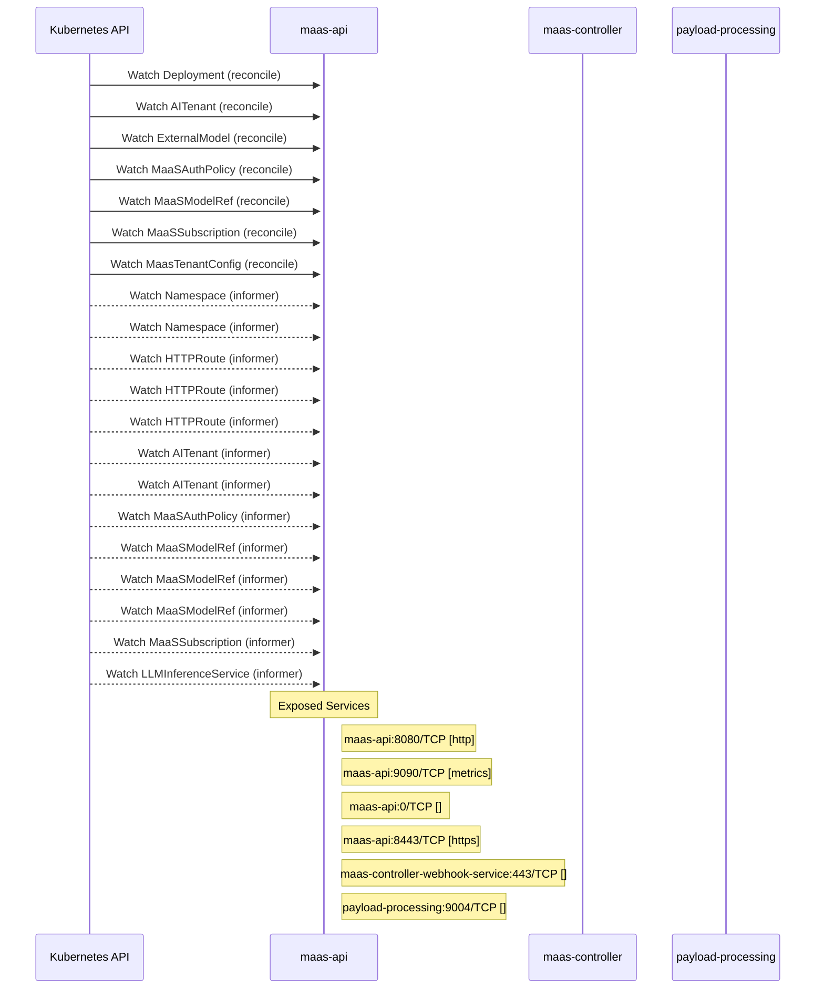

# models-as-a-service: Dataflow

## Controller Watches

Kubernetes resources this controller monitors for changes. Each watch triggers reconciliation when the watched resource is created, updated, or deleted.

| Type | GVK | Source |
|------|-----|--------|
| For | apps/v1/Deployment | [`maas-controller/pkg/controller/maas/self_deployment_controller.go:908`](https://github.com/red-hat-data-services/models-as-a-service/blob/c5d5cab6fed7f11ea101e101993b8c9b80de60ef/maas-controller/pkg/controller/maas/self_deployment_controller.go#L908) |
| For | maas/v1alpha1/AITenant | [`maas-controller/pkg/controller/maas/aitenant_controller.go:285`](https://github.com/red-hat-data-services/models-as-a-service/blob/c5d5cab6fed7f11ea101e101993b8c9b80de60ef/maas-controller/pkg/controller/maas/aitenant_controller.go#L285) |
| For | maas/v1alpha1/ExternalModel | [`maas-controller/pkg/reconciler/externalmodel/reconciler.go:319`](https://github.com/red-hat-data-services/models-as-a-service/blob/c5d5cab6fed7f11ea101e101993b8c9b80de60ef/maas-controller/pkg/reconciler/externalmodel/reconciler.go#L319) |
| For | maas/v1alpha1/MaaSAuthPolicy | [`maas-controller/pkg/controller/maas/maasauthpolicy_controller.go:1914`](https://github.com/red-hat-data-services/models-as-a-service/blob/c5d5cab6fed7f11ea101e101993b8c9b80de60ef/maas-controller/pkg/controller/maas/maasauthpolicy_controller.go#L1914) |
| For | maas/v1alpha1/MaaSModelRef | [`maas-controller/pkg/controller/maas/maasmodelref_controller.go:517`](https://github.com/red-hat-data-services/models-as-a-service/blob/c5d5cab6fed7f11ea101e101993b8c9b80de60ef/maas-controller/pkg/controller/maas/maasmodelref_controller.go#L517) |
| For | maas/v1alpha1/MaaSSubscription | [`maas-controller/pkg/controller/maas/maassubscription_controller.go:1076`](https://github.com/red-hat-data-services/models-as-a-service/blob/c5d5cab6fed7f11ea101e101993b8c9b80de60ef/maas-controller/pkg/controller/maas/maassubscription_controller.go#L1076) |
| For | maas/v1alpha1/MaasTenantConfig | [`maas-controller/pkg/controller/maas/tenant_controller.go:229`](https://github.com/red-hat-data-services/models-as-a-service/blob/c5d5cab6fed7f11ea101e101993b8c9b80de60ef/maas-controller/pkg/controller/maas/tenant_controller.go#L229) |
| Watches | /v1/Namespace | [`maas-controller/pkg/controller/maas/maasauthpolicy_controller.go:1958`](https://github.com/red-hat-data-services/models-as-a-service/blob/c5d5cab6fed7f11ea101e101993b8c9b80de60ef/maas-controller/pkg/controller/maas/maasauthpolicy_controller.go#L1958) |
| Watches | /v1/Namespace | [`maas-controller/pkg/controller/maas/maassubscription_controller.go:1122`](https://github.com/red-hat-data-services/models-as-a-service/blob/c5d5cab6fed7f11ea101e101993b8c9b80de60ef/maas-controller/pkg/controller/maas/maassubscription_controller.go#L1122) |
| Watches | apis/v1/HTTPRoute | [`maas-controller/pkg/controller/maas/maasauthpolicy_controller.go:1920`](https://github.com/red-hat-data-services/models-as-a-service/blob/c5d5cab6fed7f11ea101e101993b8c9b80de60ef/maas-controller/pkg/controller/maas/maasauthpolicy_controller.go#L1920) |
| Watches | apis/v1/HTTPRoute | [`maas-controller/pkg/controller/maas/maasmodelref_controller.go:523`](https://github.com/red-hat-data-services/models-as-a-service/blob/c5d5cab6fed7f11ea101e101993b8c9b80de60ef/maas-controller/pkg/controller/maas/maasmodelref_controller.go#L523) |
| Watches | apis/v1/HTTPRoute | [`maas-controller/pkg/controller/maas/maassubscription_controller.go:1089`](https://github.com/red-hat-data-services/models-as-a-service/blob/c5d5cab6fed7f11ea101e101993b8c9b80de60ef/maas-controller/pkg/controller/maas/maassubscription_controller.go#L1089) |
| Watches | maas/v1alpha1/AITenant | [`maas-controller/pkg/controller/maas/maassubscription_controller.go:1098`](https://github.com/red-hat-data-services/models-as-a-service/blob/c5d5cab6fed7f11ea101e101993b8c9b80de60ef/maas-controller/pkg/controller/maas/maassubscription_controller.go#L1098) |
| Watches | maas/v1alpha1/AITenant | [`maas-controller/pkg/controller/maas/maasauthpolicy_controller.go:1934`](https://github.com/red-hat-data-services/models-as-a-service/blob/c5d5cab6fed7f11ea101e101993b8c9b80de60ef/maas-controller/pkg/controller/maas/maasauthpolicy_controller.go#L1934) |
| Watches | maas/v1alpha1/MaaSAuthPolicy | [`maas-controller/pkg/controller/maas/maasmodelref_controller.go:575`](https://github.com/red-hat-data-services/models-as-a-service/blob/c5d5cab6fed7f11ea101e101993b8c9b80de60ef/maas-controller/pkg/controller/maas/maasmodelref_controller.go#L575) |
| Watches | maas/v1alpha1/MaaSModelRef | [`maas-controller/pkg/controller/maas/maassubscription_controller.go:1093`](https://github.com/red-hat-data-services/models-as-a-service/blob/c5d5cab6fed7f11ea101e101993b8c9b80de60ef/maas-controller/pkg/controller/maas/maassubscription_controller.go#L1093) |
| Watches | maas/v1alpha1/MaaSModelRef | [`maas-controller/pkg/controller/maas/maasmodelref_controller.go:533`](https://github.com/red-hat-data-services/models-as-a-service/blob/c5d5cab6fed7f11ea101e101993b8c9b80de60ef/maas-controller/pkg/controller/maas/maasmodelref_controller.go#L533) |
| Watches | maas/v1alpha1/MaaSModelRef | [`maas-controller/pkg/controller/maas/maasauthpolicy_controller.go:1924`](https://github.com/red-hat-data-services/models-as-a-service/blob/c5d5cab6fed7f11ea101e101993b8c9b80de60ef/maas-controller/pkg/controller/maas/maasauthpolicy_controller.go#L1924) |
| Watches | maas/v1alpha1/MaaSSubscription | [`maas-controller/pkg/controller/maas/maasmodelref_controller.go:571`](https://github.com/red-hat-data-services/models-as-a-service/blob/c5d5cab6fed7f11ea101e101993b8c9b80de60ef/maas-controller/pkg/controller/maas/maasmodelref_controller.go#L571) |
| Watches | serving/v1alpha2/LLMInferenceService | [`maas-controller/pkg/controller/maas/maasmodelref_controller.go:559`](https://github.com/red-hat-data-services/models-as-a-service/blob/c5d5cab6fed7f11ea101e101993b8c9b80de60ef/maas-controller/pkg/controller/maas/maasmodelref_controller.go#L559) |

## Reconciliation Flow

How the controller interacts with the Kubernetes API during reconciliation.

### Webhooks

| Name | Type | Path | Failure Policy | Service | Overlays | Enable Condition | Sources |
|------|------|------|----------------|---------|----------|------------------|----------|
| vaitenant.kb.io | validating | /validate-maas-opendatahub-io-v1alpha1-aitenant | Fail | system/maas-controller-webhook-service |  |  | [`deployment/base/maas-controller/webhook/validating_webhook_configuration.yaml`](https://github.com/red-hat-data-services/models-as-a-service/blob/c5d5cab6fed7f11ea101e101993b8c9b80de60ef/deployment/base/maas-controller/webhook/validating_webhook_configuration.yaml) |
| vmaasauthpolicy.kb.io | validating | /validate-maas-opendatahub-io-v1alpha1-maasauthpolicy | Fail | system/maas-controller-webhook-service |  |  | [`deployment/base/maas-controller/webhook/validating_webhook_configuration.yaml`](https://github.com/red-hat-data-services/models-as-a-service/blob/c5d5cab6fed7f11ea101e101993b8c9b80de60ef/deployment/base/maas-controller/webhook/validating_webhook_configuration.yaml) |
| vmaasmodelref.kb.io | validating | /validate-maas-opendatahub-io-v1alpha1-maasmodelref | Fail | system/maas-controller-webhook-service |  |  | [`deployment/base/maas-controller/webhook/validating_webhook_configuration.yaml`](https://github.com/red-hat-data-services/models-as-a-service/blob/c5d5cab6fed7f11ea101e101993b8c9b80de60ef/deployment/base/maas-controller/webhook/validating_webhook_configuration.yaml) |
| vmaassubscription.kb.io | validating | /validate-maas-opendatahub-io-v1alpha1-maassubscription | Fail | system/maas-controller-webhook-service |  |  | [`deployment/base/maas-controller/webhook/validating_webhook_configuration.yaml`](https://github.com/red-hat-data-services/models-as-a-service/blob/c5d5cab6fed7f11ea101e101993b8c9b80de60ef/deployment/base/maas-controller/webhook/validating_webhook_configuration.yaml) |

### HTTP Endpoints

| Method | Path | Source |
|--------|------|--------|
| OPTIONS | /*path | [`maas-api/cmd/main.go:149`](https://github.com/red-hat-data-services/models-as-a-service/blob/c5d5cab6fed7f11ea101e101993b8c9b80de60ef/maas-api/cmd/main.go#L149) |
| DELETE | /:id | [`maas-api/cmd/main.go:295`](https://github.com/red-hat-data-services/models-as-a-service/blob/c5d5cab6fed7f11ea101e101993b8c9b80de60ef/maas-api/cmd/main.go#L295) |
| GET | /:id | [`maas-api/cmd/main.go:294`](https://github.com/red-hat-data-services/models-as-a-service/blob/c5d5cab6fed7f11ea101e101993b8c9b80de60ef/maas-api/cmd/main.go#L294) |
| * | /api-keys | [`maas-api/cmd/main.go:290`](https://github.com/red-hat-data-services/models-as-a-service/blob/c5d5cab6fed7f11ea101e101993b8c9b80de60ef/maas-api/cmd/main.go#L290) |
| POST | /api-keys/cleanup | [`maas-api/cmd/main.go:309`](https://github.com/red-hat-data-services/models-as-a-service/blob/c5d5cab6fed7f11ea101e101993b8c9b80de60ef/maas-api/cmd/main.go#L309) |
| POST | /api-keys/search | [`maas-api/cmd/main.go:298`](https://github.com/red-hat-data-services/models-as-a-service/blob/c5d5cab6fed7f11ea101e101993b8c9b80de60ef/maas-api/cmd/main.go#L298) |
| POST | /api-keys/validate | [`maas-api/cmd/main.go:308`](https://github.com/red-hat-data-services/models-as-a-service/blob/c5d5cab6fed7f11ea101e101993b8c9b80de60ef/maas-api/cmd/main.go#L308) |
| POST | /bulk-revoke | [`maas-api/cmd/main.go:293`](https://github.com/red-hat-data-services/models-as-a-service/blob/c5d5cab6fed7f11ea101e101993b8c9b80de60ef/maas-api/cmd/main.go#L293) |
| GET | /config | [`maas-api/cmd/main.go:291`](https://github.com/red-hat-data-services/models-as-a-service/blob/c5d5cab6fed7f11ea101e101993b8c9b80de60ef/maas-api/cmd/main.go#L291) |
| GET | /health | [`maas-api/cmd/main.go:231`](https://github.com/red-hat-data-services/models-as-a-service/blob/c5d5cab6fed7f11ea101e101993b8c9b80de60ef/maas-api/cmd/main.go#L231) |
| * | /internal/v1 | [`maas-api/cmd/main.go:307`](https://github.com/red-hat-data-services/models-as-a-service/blob/c5d5cab6fed7f11ea101e101993b8c9b80de60ef/maas-api/cmd/main.go#L307) |
| * | /metrics | [`maas-api/internal/metrics/server.go:19`](https://github.com/red-hat-data-services/models-as-a-service/blob/c5d5cab6fed7f11ea101e101993b8c9b80de60ef/maas-api/internal/metrics/server.go#L19) |
| GET | /model/:model-id/subscriptions | [`maas-api/cmd/main.go:283`](https://github.com/red-hat-data-services/models-as-a-service/blob/c5d5cab6fed7f11ea101e101993b8c9b80de60ef/maas-api/cmd/main.go#L283) |
| GET | /models | [`maas-api/cmd/main.go:278`](https://github.com/red-hat-data-services/models-as-a-service/blob/c5d5cab6fed7f11ea101e101993b8c9b80de60ef/maas-api/cmd/main.go#L278) |
| GET | /subscriptions | [`maas-api/cmd/main.go:282`](https://github.com/red-hat-data-services/models-as-a-service/blob/c5d5cab6fed7f11ea101e101993b8c9b80de60ef/maas-api/cmd/main.go#L282) |
| POST | /subscriptions/select | [`maas-api/cmd/main.go:311`](https://github.com/red-hat-data-services/models-as-a-service/blob/c5d5cab6fed7f11ea101e101993b8c9b80de60ef/maas-api/cmd/main.go#L311) |
| GET | /tenants | [`maas-api/cmd/main.go:302`](https://github.com/red-hat-data-services/models-as-a-service/blob/c5d5cab6fed7f11ea101e101993b8c9b80de60ef/maas-api/cmd/main.go#L302) |
| DELETE | /tenants/:tenant/api-keys | [`maas-api/cmd/main.go:310`](https://github.com/red-hat-data-services/models-as-a-service/blob/c5d5cab6fed7f11ea101e101993b8c9b80de60ef/maas-api/cmd/main.go#L310) |
| * | /v1 | [`maas-api/cmd/main.go:239`](https://github.com/red-hat-data-services/models-as-a-service/blob/c5d5cab6fed7f11ea101e101993b8c9b80de60ef/maas-api/cmd/main.go#L239) |

## Configuration

ConfigMaps and Helm values that control this component's runtime behavior.

