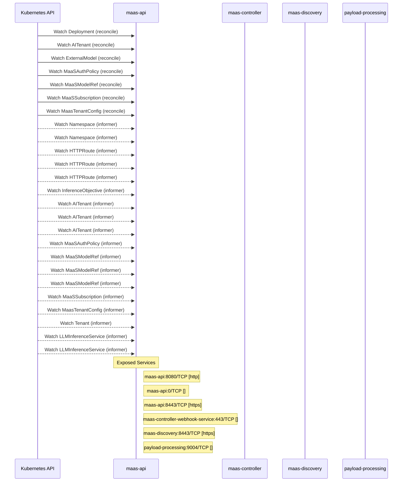

# models-as-a-service: Dataflow

## Controller Watches

Kubernetes resources this controller monitors for changes. Each watch triggers reconciliation when the watched resource is created, updated, or deleted.

| Type | GVK | Source |
|------|-----|--------|
| For | apps/v1/Deployment | [`maas-controller/pkg/controller/maas/self_deployment_controller.go:976`](https://github.com/red-hat-data-services/models-as-a-service/blob/98abc65dff64572c48d1dc9e9f48d6fa9cdf3d2c/maas-controller/pkg/controller/maas/self_deployment_controller.go#L976) |
| For | maas/v1alpha1/AITenant | [`maas-controller/pkg/controller/maas/aitenant_controller.go:290`](https://github.com/red-hat-data-services/models-as-a-service/blob/98abc65dff64572c48d1dc9e9f48d6fa9cdf3d2c/maas-controller/pkg/controller/maas/aitenant_controller.go#L290) |
| For | maas/v1alpha1/ExternalModel | [`maas-controller/pkg/reconciler/externalmodel/reconciler.go:439`](https://github.com/red-hat-data-services/models-as-a-service/blob/98abc65dff64572c48d1dc9e9f48d6fa9cdf3d2c/maas-controller/pkg/reconciler/externalmodel/reconciler.go#L439) |
| For | maas/v1alpha1/MaaSAuthPolicy | [`maas-controller/pkg/controller/maas/maasauthpolicy_controller.go:2054`](https://github.com/red-hat-data-services/models-as-a-service/blob/98abc65dff64572c48d1dc9e9f48d6fa9cdf3d2c/maas-controller/pkg/controller/maas/maasauthpolicy_controller.go#L2054) |
| For | maas/v1alpha1/MaaSModelRef | [`maas-controller/pkg/controller/maas/maasmodelref_controller.go:671`](https://github.com/red-hat-data-services/models-as-a-service/blob/98abc65dff64572c48d1dc9e9f48d6fa9cdf3d2c/maas-controller/pkg/controller/maas/maasmodelref_controller.go#L671) |
| For | maas/v1alpha1/MaaSSubscription | [`maas-controller/pkg/controller/maas/maassubscription_controller.go:1236`](https://github.com/red-hat-data-services/models-as-a-service/blob/98abc65dff64572c48d1dc9e9f48d6fa9cdf3d2c/maas-controller/pkg/controller/maas/maassubscription_controller.go#L1236) |
| For | maas/v1alpha1/MaasTenantConfig | [`maas-controller/pkg/controller/maas/tenant_controller.go:313`](https://github.com/red-hat-data-services/models-as-a-service/blob/98abc65dff64572c48d1dc9e9f48d6fa9cdf3d2c/maas-controller/pkg/controller/maas/tenant_controller.go#L313) |
| Watches | /v1/Namespace | [`maas-controller/pkg/controller/maas/maasauthpolicy_controller.go:2098`](https://github.com/red-hat-data-services/models-as-a-service/blob/98abc65dff64572c48d1dc9e9f48d6fa9cdf3d2c/maas-controller/pkg/controller/maas/maasauthpolicy_controller.go#L2098) |
| Watches | /v1/Namespace | [`maas-controller/pkg/controller/maas/maassubscription_controller.go:1315`](https://github.com/red-hat-data-services/models-as-a-service/blob/98abc65dff64572c48d1dc9e9f48d6fa9cdf3d2c/maas-controller/pkg/controller/maas/maassubscription_controller.go#L1315) |
| Watches | apis/v1/HTTPRoute | [`maas-controller/pkg/controller/maas/maasmodelref_controller.go:677`](https://github.com/red-hat-data-services/models-as-a-service/blob/98abc65dff64572c48d1dc9e9f48d6fa9cdf3d2c/maas-controller/pkg/controller/maas/maasmodelref_controller.go#L677) |
| Watches | apis/v1/HTTPRoute | [`maas-controller/pkg/controller/maas/maassubscription_controller.go:1249`](https://github.com/red-hat-data-services/models-as-a-service/blob/98abc65dff64572c48d1dc9e9f48d6fa9cdf3d2c/maas-controller/pkg/controller/maas/maassubscription_controller.go#L1249) |
| Watches | apis/v1/HTTPRoute | [`maas-controller/pkg/controller/maas/maasauthpolicy_controller.go:2060`](https://github.com/red-hat-data-services/models-as-a-service/blob/98abc65dff64572c48d1dc9e9f48d6fa9cdf3d2c/maas-controller/pkg/controller/maas/maasauthpolicy_controller.go#L2060) |
| Watches | apix/v1alpha2/InferenceObjective | [`maas-controller/pkg/controller/maas/maassubscription_controller.go:1287`](https://github.com/red-hat-data-services/models-as-a-service/blob/98abc65dff64572c48d1dc9e9f48d6fa9cdf3d2c/maas-controller/pkg/controller/maas/maassubscription_controller.go#L1287) |
| Watches | maas/v1alpha1/AITenant | [`maas-controller/pkg/controller/maas/maasmodelref_controller.go:744`](https://github.com/red-hat-data-services/models-as-a-service/blob/98abc65dff64572c48d1dc9e9f48d6fa9cdf3d2c/maas-controller/pkg/controller/maas/maasmodelref_controller.go#L744) |
| Watches | maas/v1alpha1/AITenant | [`maas-controller/pkg/controller/maas/maassubscription_controller.go:1258`](https://github.com/red-hat-data-services/models-as-a-service/blob/98abc65dff64572c48d1dc9e9f48d6fa9cdf3d2c/maas-controller/pkg/controller/maas/maassubscription_controller.go#L1258) |
| Watches | maas/v1alpha1/AITenant | [`maas-controller/pkg/controller/maas/maasauthpolicy_controller.go:2074`](https://github.com/red-hat-data-services/models-as-a-service/blob/98abc65dff64572c48d1dc9e9f48d6fa9cdf3d2c/maas-controller/pkg/controller/maas/maasauthpolicy_controller.go#L2074) |
| Watches | maas/v1alpha1/MaaSAuthPolicy | [`maas-controller/pkg/controller/maas/maasmodelref_controller.go:738`](https://github.com/red-hat-data-services/models-as-a-service/blob/98abc65dff64572c48d1dc9e9f48d6fa9cdf3d2c/maas-controller/pkg/controller/maas/maasmodelref_controller.go#L738) |
| Watches | maas/v1alpha1/MaaSModelRef | [`maas-controller/pkg/controller/maas/maassubscription_controller.go:1253`](https://github.com/red-hat-data-services/models-as-a-service/blob/98abc65dff64572c48d1dc9e9f48d6fa9cdf3d2c/maas-controller/pkg/controller/maas/maassubscription_controller.go#L1253) |
| Watches | maas/v1alpha1/MaaSModelRef | [`maas-controller/pkg/controller/maas/maasmodelref_controller.go:687`](https://github.com/red-hat-data-services/models-as-a-service/blob/98abc65dff64572c48d1dc9e9f48d6fa9cdf3d2c/maas-controller/pkg/controller/maas/maasmodelref_controller.go#L687) |
| Watches | maas/v1alpha1/MaaSModelRef | [`maas-controller/pkg/controller/maas/maasauthpolicy_controller.go:2064`](https://github.com/red-hat-data-services/models-as-a-service/blob/98abc65dff64572c48d1dc9e9f48d6fa9cdf3d2c/maas-controller/pkg/controller/maas/maasauthpolicy_controller.go#L2064) |
| Watches | maas/v1alpha1/MaaSSubscription | [`maas-controller/pkg/controller/maas/maasmodelref_controller.go:734`](https://github.com/red-hat-data-services/models-as-a-service/blob/98abc65dff64572c48d1dc9e9f48d6fa9cdf3d2c/maas-controller/pkg/controller/maas/maasmodelref_controller.go#L734) |
| Watches | maas/v1alpha1/MaasTenantConfig | [`maas-controller/pkg/controller/maas/maassubscription_controller.go:1263`](https://github.com/red-hat-data-services/models-as-a-service/blob/98abc65dff64572c48d1dc9e9f48d6fa9cdf3d2c/maas-controller/pkg/controller/maas/maassubscription_controller.go#L1263) |
| Watches | maas/v1alpha1/Tenant | [`maas-controller/pkg/controller/maas/maassubscription_controller.go:1266`](https://github.com/red-hat-data-services/models-as-a-service/blob/98abc65dff64572c48d1dc9e9f48d6fa9cdf3d2c/maas-controller/pkg/controller/maas/maassubscription_controller.go#L1266) |
| Watches | serving/v1alpha2/LLMInferenceService | [`maas-controller/pkg/controller/maas/maassubscription_controller.go:1275`](https://github.com/red-hat-data-services/models-as-a-service/blob/98abc65dff64572c48d1dc9e9f48d6fa9cdf3d2c/maas-controller/pkg/controller/maas/maassubscription_controller.go#L1275) |
| Watches | serving/v1alpha2/LLMInferenceService | [`maas-controller/pkg/controller/maas/maasmodelref_controller.go:713`](https://github.com/red-hat-data-services/models-as-a-service/blob/98abc65dff64572c48d1dc9e9f48d6fa9cdf3d2c/maas-controller/pkg/controller/maas/maasmodelref_controller.go#L713) |

## Reconciliation Flow

How the controller interacts with the Kubernetes API during reconciliation.

```mermaid
sequenceDiagram
    %% Static dataflow for models-as-a-service

    participant KubernetesAPI as Kubernetes API
    participant maas_api as maas-api
    participant maas_controller as maas-controller
    participant maas_discovery as maas-discovery
    participant payload_processing as payload-processing

    KubernetesAPI->>+maas_api: Watch Deployment (reconcile)
    KubernetesAPI->>+maas_api: Watch AITenant (reconcile)
    KubernetesAPI->>+maas_api: Watch ExternalModel (reconcile)
    KubernetesAPI->>+maas_api: Watch MaaSAuthPolicy (reconcile)
    KubernetesAPI->>+maas_api: Watch MaaSModelRef (reconcile)
    KubernetesAPI->>+maas_api: Watch MaaSSubscription (reconcile)
    KubernetesAPI->>+maas_api: Watch MaasTenantConfig (reconcile)
    KubernetesAPI-->>+maas_api: Watch Namespace (informer)
    KubernetesAPI-->>+maas_api: Watch Namespace (informer)
    KubernetesAPI-->>+maas_api: Watch HTTPRoute (informer)
    KubernetesAPI-->>+maas_api: Watch HTTPRoute (informer)
    KubernetesAPI-->>+maas_api: Watch HTTPRoute (informer)
    KubernetesAPI-->>+maas_api: Watch InferenceObjective (informer)
    KubernetesAPI-->>+maas_api: Watch AITenant (informer)
    KubernetesAPI-->>+maas_api: Watch AITenant (informer)
    KubernetesAPI-->>+maas_api: Watch AITenant (informer)
    KubernetesAPI-->>+maas_api: Watch MaaSAuthPolicy (informer)
    KubernetesAPI-->>+maas_api: Watch MaaSModelRef (informer)
    KubernetesAPI-->>+maas_api: Watch MaaSModelRef (informer)
    KubernetesAPI-->>+maas_api: Watch MaaSModelRef (informer)
    KubernetesAPI-->>+maas_api: Watch MaaSSubscription (informer)
    KubernetesAPI-->>+maas_api: Watch MaasTenantConfig (informer)
    KubernetesAPI-->>+maas_api: Watch Tenant (informer)
    KubernetesAPI-->>+maas_api: Watch LLMInferenceService (informer)
    KubernetesAPI-->>+maas_api: Watch LLMInferenceService (informer)

    Note over maas_api: Exposed Services
    Note right of maas_api: maas-api:8080/TCP [http]
    Note right of maas_api: maas-api:0/TCP []
    Note right of maas_api: maas-api:8443/TCP [https]
    Note right of maas_api: maas-controller-webhook-service:443/TCP []
    Note right of maas_api: maas-discovery:8443/TCP [https]
    Note right of maas_api: payload-processing:9004/TCP []
```

### Webhooks

| Name | Type | Path | Failure Policy | Service | Overlays | Enable Condition | Sources |
|------|------|------|----------------|---------|----------|------------------|----------|
| vaitenant.kb.io | validating | /validate-maas-opendatahub-io-v1alpha1-aitenant | Fail | system/maas-controller-webhook-service |  |  | [`deployment/base/maas-controller/webhook/validating_webhook_configuration.yaml`](https://github.com/red-hat-data-services/models-as-a-service/blob/98abc65dff64572c48d1dc9e9f48d6fa9cdf3d2c/deployment/base/maas-controller/webhook/validating_webhook_configuration.yaml) |
| vmaasauthpolicy.kb.io | validating | /validate-maas-opendatahub-io-v1alpha1-maasauthpolicy | Fail | system/maas-controller-webhook-service |  |  | [`deployment/base/maas-controller/webhook/validating_webhook_configuration.yaml`](https://github.com/red-hat-data-services/models-as-a-service/blob/98abc65dff64572c48d1dc9e9f48d6fa9cdf3d2c/deployment/base/maas-controller/webhook/validating_webhook_configuration.yaml) |
| vmaasmodelref.kb.io | validating | /validate-maas-opendatahub-io-v1alpha1-maasmodelref | Fail | system/maas-controller-webhook-service |  |  | [`deployment/base/maas-controller/webhook/validating_webhook_configuration.yaml`](https://github.com/red-hat-data-services/models-as-a-service/blob/98abc65dff64572c48d1dc9e9f48d6fa9cdf3d2c/deployment/base/maas-controller/webhook/validating_webhook_configuration.yaml) |
| vmaassubscription.kb.io | validating | /validate-maas-opendatahub-io-v1alpha1-maassubscription | Fail | system/maas-controller-webhook-service |  |  | [`deployment/base/maas-controller/webhook/validating_webhook_configuration.yaml`](https://github.com/red-hat-data-services/models-as-a-service/blob/98abc65dff64572c48d1dc9e9f48d6fa9cdf3d2c/deployment/base/maas-controller/webhook/validating_webhook_configuration.yaml) |

### HTTP Endpoints

| Method | Path | Source |
|--------|------|--------|
| OPTIONS | /*path | [`maas-api/cmd/main.go:171`](https://github.com/red-hat-data-services/models-as-a-service/blob/98abc65dff64572c48d1dc9e9f48d6fa9cdf3d2c/maas-api/cmd/main.go#L171) |
| DELETE | /:id | [`maas-api/cmd/main.go:314`](https://github.com/red-hat-data-services/models-as-a-service/blob/98abc65dff64572c48d1dc9e9f48d6fa9cdf3d2c/maas-api/cmd/main.go#L314) |
| GET | /:id | [`maas-api/cmd/main.go:313`](https://github.com/red-hat-data-services/models-as-a-service/blob/98abc65dff64572c48d1dc9e9f48d6fa9cdf3d2c/maas-api/cmd/main.go#L313) |
| * | /api-keys | [`maas-api/cmd/main.go:309`](https://github.com/red-hat-data-services/models-as-a-service/blob/98abc65dff64572c48d1dc9e9f48d6fa9cdf3d2c/maas-api/cmd/main.go#L309) |
| POST | /api-keys/cleanup | [`maas-api/cmd/main.go:331`](https://github.com/red-hat-data-services/models-as-a-service/blob/98abc65dff64572c48d1dc9e9f48d6fa9cdf3d2c/maas-api/cmd/main.go#L331) |
| POST | /api-keys/search | [`maas-api/cmd/main.go:317`](https://github.com/red-hat-data-services/models-as-a-service/blob/98abc65dff64572c48d1dc9e9f48d6fa9cdf3d2c/maas-api/cmd/main.go#L317) |
| POST | /api-keys/validate | [`maas-api/cmd/main.go:329`](https://github.com/red-hat-data-services/models-as-a-service/blob/98abc65dff64572c48d1dc9e9f48d6fa9cdf3d2c/maas-api/cmd/main.go#L329) |
| POST | /bulk-revoke | [`maas-api/cmd/main.go:312`](https://github.com/red-hat-data-services/models-as-a-service/blob/98abc65dff64572c48d1dc9e9f48d6fa9cdf3d2c/maas-api/cmd/main.go#L312) |
| GET | /config | [`maas-api/cmd/main.go:310`](https://github.com/red-hat-data-services/models-as-a-service/blob/98abc65dff64572c48d1dc9e9f48d6fa9cdf3d2c/maas-api/cmd/main.go#L310) |
| GET | /health | [`maas-api/cmd/main.go:250`](https://github.com/red-hat-data-services/models-as-a-service/blob/98abc65dff64572c48d1dc9e9f48d6fa9cdf3d2c/maas-api/cmd/main.go#L250) |
| GET | /healthz | [`maas-discovery/internal/handler/handler.go:50`](https://github.com/red-hat-data-services/models-as-a-service/blob/98abc65dff64572c48d1dc9e9f48d6fa9cdf3d2c/maas-discovery/internal/handler/handler.go#L50) |
| * | /internal/v1 | [`maas-api/cmd/main.go:328`](https://github.com/red-hat-data-services/models-as-a-service/blob/98abc65dff64572c48d1dc9e9f48d6fa9cdf3d2c/maas-api/cmd/main.go#L328) |
| * | /metrics | [`maas-api/internal/metrics/server.go:86`](https://github.com/red-hat-data-services/models-as-a-service/blob/98abc65dff64572c48d1dc9e9f48d6fa9cdf3d2c/maas-api/internal/metrics/server.go#L86) |
| GET | /model/:model-id/subscriptions | [`maas-api/cmd/main.go:302`](https://github.com/red-hat-data-services/models-as-a-service/blob/98abc65dff64572c48d1dc9e9f48d6fa9cdf3d2c/maas-api/cmd/main.go#L302) |
| GET | /models | [`maas-api/cmd/main.go:297`](https://github.com/red-hat-data-services/models-as-a-service/blob/98abc65dff64572c48d1dc9e9f48d6fa9cdf3d2c/maas-api/cmd/main.go#L297) |
| GET | /readyz | [`maas-discovery/internal/handler/handler.go:51`](https://github.com/red-hat-data-services/models-as-a-service/blob/98abc65dff64572c48d1dc9e9f48d6fa9cdf3d2c/maas-discovery/internal/handler/handler.go#L51) |
| GET | /subscriptions | [`maas-api/cmd/main.go:301`](https://github.com/red-hat-data-services/models-as-a-service/blob/98abc65dff64572c48d1dc9e9f48d6fa9cdf3d2c/maas-api/cmd/main.go#L301) |
| POST | /subscriptions/select | [`maas-api/cmd/main.go:334`](https://github.com/red-hat-data-services/models-as-a-service/blob/98abc65dff64572c48d1dc9e9f48d6fa9cdf3d2c/maas-api/cmd/main.go#L334) |
| GET | /tenants | [`maas-api/cmd/main.go:321`](https://github.com/red-hat-data-services/models-as-a-service/blob/98abc65dff64572c48d1dc9e9f48d6fa9cdf3d2c/maas-api/cmd/main.go#L321) |
| DELETE | /tenants/:tenant/api-keys | [`maas-api/cmd/main.go:332`](https://github.com/red-hat-data-services/models-as-a-service/blob/98abc65dff64572c48d1dc9e9f48d6fa9cdf3d2c/maas-api/cmd/main.go#L332) |
| DELETE | /tenants/:tenant/subscriptions/:subscription/api-keys | [`maas-api/cmd/main.go:333`](https://github.com/red-hat-data-services/models-as-a-service/blob/98abc65dff64572c48d1dc9e9f48d6fa9cdf3d2c/maas-api/cmd/main.go#L333) |
| * | /v1 | [`maas-api/cmd/main.go:258`](https://github.com/red-hat-data-services/models-as-a-service/blob/98abc65dff64572c48d1dc9e9f48d6fa9cdf3d2c/maas-api/cmd/main.go#L258) |
| GET | /v1/tenants | [`maas-discovery/internal/handler/handler.go:49`](https://github.com/red-hat-data-services/models-as-a-service/blob/98abc65dff64572c48d1dc9e9f48d6fa9cdf3d2c/maas-discovery/internal/handler/handler.go#L49) |

## Configuration

ConfigMaps and Helm values that control this component's runtime behavior.

