# odh-dashboard

> **Architecture snapshot: 2026-09-07** (2026-09-07)

**Repository:** red-hat-data-services/odh-dashboard  
**Analyzer:** arch-analyzer dev  
**Extracted:** 2026-09-07T03:58:56Z

## Summary

| Metric | Count |
|--------|-------|
| CRDs | 0 |
| Deployments | 22 |
| Services | 16 |
| Secrets | 15 |
| Cluster Roles | 11 |
| Controller Watches | 10 |

## Component Architecture

CRDs, controllers, and owned Kubernetes resources.

```mermaid
graph LR
    %% Component architecture for odh-dashboard

    classDef crd fill:#e74c3c,stroke:#c0392b,color:#fff
    classDef controller fill:#3498db,stroke:#2980b9,color:#fff
    classDef owned fill:#2ecc71,stroke:#27ae60,color:#fff
    classDef external fill:#95a5a6,stroke:#7f8c8d,color:#fff
    classDef dep fill:#f39c12,stroke:#e67e22,color:#fff

    subgraph controller["odh-dashboard Controller"]
        dep_1["agent-ops-ui"]
        class dep_1 controller
        dep_2["automl-ui"]
        class dep_2 controller
        dep_3["autorag-ui"]
        class dep_3 controller
        dep_4["dashboard-operator"]
        class dep_4 controller
        dep_5["data-registry-ui"]
        class dep_5 controller
        dep_6["eval-hub-ui"]
        class dep_6 controller
        dep_7["gen-ai-ui"]
        class dep_7 controller
        dep_8["maas-ui"]
        class dep_8 controller
        dep_9["mlflow-ui"]
        class dep_9 controller
        dep_10["model-registry-ui"]
        class dep_10 controller
        dep_11["notebooks-ui"]
        class dep_11 controller
        dep_12["odh-dashboard"]
        class dep_12 controller
        dep_13["rhaii-dashboard"]
        class dep_13 controller
        dep_14["workspaces-backend"]
        class dep_14 controller
        dep_15["workspaces-backend"]
        class dep_15 controller
        dep_16["workspaces-controller"]
        class dep_16 controller
        dep_17["workspaces-controller"]
        class dep_17 controller
        dep_18["workspaces-controller"]
        class dep_18 controller
        dep_19["workspaces-controller"]
        class dep_19 controller
        dep_20["workspaces-controller"]
        class dep_20 controller
        dep_21["workspaces-controller"]
        class dep_21 controller
        dep_22["workspaces-frontend"]
        class dep_22 controller
    end

    controller -->|"Owns"| owned_23["ConfigMap"]
    class owned_23 owned
    controller -->|"Owns"| owned_24["Deployment"]
    class owned_24 owned
    controller -->|"Owns"| owned_25["PodDisruptionBudget"]
    class owned_25 owned
    controller -->|"Owns"| owned_26["Service"]
    class owned_26 owned
    controller -->|"Owns"| owned_27["StatefulSet"]
    class owned_27 owned
    controller -->|"Owns"| owned_28["VirtualService"]
    class owned_28 owned
    controller -.->|"depends on"| odh_29["mlflow-go"]
    class odh_29 dep
    controller -.->|"depends on"| odh_30["mlflow-go"]
    class odh_30 dep
    controller -.->|"depends on"| odh_31["odh-dashboard"]
    class odh_31 dep
    controller -.->|"depends on"| odh_32["odh-dashboard"]
    class odh_32 dep
    controller -.->|"depends on"| odh_33["odh-platform-utilities"]
    class odh_33 dep
    controller -.->|"depends on"| odh_34["ogx-k8s-operator"]
    class odh_34 dep
```

### CRDs

No CRDs found in analyzed sources.

## Dependencies

### Internal Platform Dependencies

| Component | Interaction |
|-----------|-------------|
| mlflow-go | Go module dependency: github.com/opendatahub-io/mlflow-go |
| mlflow-go | Go module dependency: github.com/opendatahub-io/mlflow-go |
| odh-dashboard | Go module dependency: github.com/opendatahub-io/odh-dashboard/packages/autox-core/services |
| odh-dashboard | Go module dependency: github.com/opendatahub-io/odh-dashboard/packages/autox-core/services |
| odh-platform-utilities | Go module dependency: github.com/opendatahub-io/odh-platform-utilities |
| ogx-k8s-operator | Go module dependency: github.com/opendatahub-io/ogx-k8s-operator |

### Key External Dependencies

| Module | Version |
|--------|---------|
| github.com/go-logr/logr | v1.4.3 |
| k8s.io/api | v0.37.0 |
| k8s.io/api | v0.34.1 |
| k8s.io/api | v0.34.3 |
| k8s.io/api | v0.34.3 |
| k8s.io/api | v0.36.3 |
| k8s.io/api | v0.34.1 |
| k8s.io/api | v0.34.3 |
| k8s.io/api | v0.34.3 |
| k8s.io/api | v0.34.1 |
| k8s.io/api | v0.34.1 |
| k8s.io/api | v0.34.1 |
| k8s.io/api | v0.36.2 |
| k8s.io/api | v0.34.1 |
| k8s.io/api | v0.34.1 |
| k8s.io/apiextensions-apiserver | v0.36.1 |
| k8s.io/apiextensions-apiserver | v0.34.1 |
| k8s.io/apiextensions-apiserver | v0.34.3 |
| k8s.io/apimachinery | v0.34.3 |
| k8s.io/apimachinery | v0.34.3 |
| k8s.io/apimachinery | v0.34.1 |
| k8s.io/apimachinery | v0.34.1 |
| k8s.io/apimachinery | v0.36.2 |
| k8s.io/apimachinery | v0.34.1 |
| k8s.io/apimachinery | v0.34.1 |
| k8s.io/apimachinery | v0.34.1 |
| k8s.io/apimachinery | v0.34.1 |
| k8s.io/apimachinery | v0.34.3 |
| k8s.io/apimachinery | v0.36.3 |
| k8s.io/apimachinery | v0.37.0 |
| k8s.io/apimachinery | v0.34.3 |
| k8s.io/apimachinery | v0.34.1 |
| k8s.io/apiserver | v0.34.1 |
| k8s.io/client-go | v0.34.1 |
| k8s.io/client-go | v0.36.1 |
| k8s.io/client-go | v0.36.3 |
| k8s.io/client-go | v0.34.3 |
| k8s.io/client-go | v0.37.0 |
| k8s.io/client-go | v0.34.1 |
| k8s.io/client-go | v0.34.1 |
| k8s.io/client-go | v0.34.3 |
| k8s.io/client-go | v0.34.1 |
| k8s.io/client-go | v0.34.3 |
| k8s.io/client-go | v0.34.1 |
| k8s.io/client-go | v0.34.3 |
| k8s.io/client-go | v0.34.1 |
| k8s.io/client-go | v0.34.1 |
| sigs.k8s.io/controller-runtime | v0.22.3 |
| sigs.k8s.io/controller-runtime | v0.22.1 |
| sigs.k8s.io/controller-runtime | v0.22.3 |
| sigs.k8s.io/controller-runtime | v0.24.1 |
| sigs.k8s.io/controller-runtime | v0.22.3 |
| sigs.k8s.io/controller-runtime | v0.24.1 |
| sigs.k8s.io/controller-runtime | v0.22.4 |
| sigs.k8s.io/controller-runtime | v0.22.3 |
| sigs.k8s.io/controller-runtime | v0.22.3 |
| sigs.k8s.io/controller-runtime | v0.24.1 |
| sigs.k8s.io/controller-runtime | v0.22.1 |

