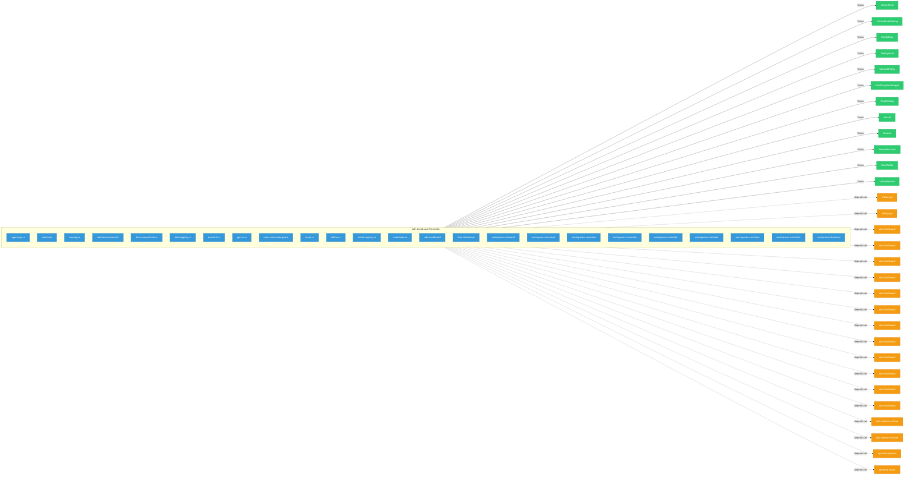

# odh-dashboard

> **Architecture snapshot: 2026-09-26** (2026-09-26)

**Repository:** red-hat-data-services/odh-dashboard  
**Analyzer:** arch-analyzer dev  
**Extracted:** 2026-09-26T04:28:03Z

## Summary

| Metric | Count |
|--------|-------|
| CRDs | 0 |
| Deployments | 24 |
| Services | 18 |
| Secrets | 18 |
| Cluster Roles | 13 |
| Controller Watches | 17 |

## Component Architecture

CRDs, controllers, and owned Kubernetes resources.

### CRDs

No CRDs found in analyzed sources.

## Dependencies

### Internal Platform Dependencies

| Component | Interaction |
|-----------|-------------|
| mlflow-go | Go module dependency: github.com/opendatahub-io/mlflow-go |
| mlflow-go | Go module dependency: github.com/opendatahub-io/mlflow-go |
| odh-dashboard | Go module dependency: github.com/opendatahub-io/odh-dashboard/pkg/tls |
| odh-dashboard | Go module dependency: github.com/opendatahub-io/odh-dashboard/pkg/tls |
| odh-dashboard | Go module dependency: github.com/opendatahub-io/odh-dashboard/pkg/tls |
| odh-dashboard | Go module dependency: github.com/opendatahub-io/odh-dashboard/packages/autox-core/services |
| odh-dashboard | Go module dependency: github.com/opendatahub-io/odh-dashboard/pkg/tls |
| odh-dashboard | Go module dependency: github.com/opendatahub-io/odh-dashboard/packages/autox-core/services |
| odh-dashboard | Go module dependency: github.com/opendatahub-io/odh-dashboard/pkg/tls |
| odh-dashboard | Go module dependency: github.com/opendatahub-io/odh-dashboard/pkg/tls |
| odh-dashboard | Go module dependency: github.com/opendatahub-io/odh-dashboard/pkg/tls |
| odh-dashboard | Go module dependency: github.com/opendatahub-io/odh-dashboard/pkg/tls |
| odh-dashboard | Go module dependency: github.com/opendatahub-io/odh-dashboard/pkg/tls |
| odh-dashboard | Go module dependency: github.com/opendatahub-io/odh-dashboard/pkg/tls |
| odh-platform-utilities | Go module dependency: github.com/opendatahub-io/odh-platform-utilities/framework |
| odh-platform-utilities | Go module dependency: github.com/opendatahub-io/odh-platform-utilities |
| ogx-k8s-operator | Go module dependency: github.com/opendatahub-io/ogx-k8s-operator |
| operator-chaos | Go module dependency: github.com/opendatahub-io/operator-chaos |

### Key External Dependencies

| Module | Version |
|--------|---------|
| github.com/go-logr/logr | v1.4.3 |
| k8s.io/api | v0.34.3 |
| k8s.io/api | v0.34.3 |
| k8s.io/api | v0.34.3 |
| k8s.io/api | v0.34.3 |
| k8s.io/api | v0.34.1 |
| k8s.io/api | v0.37.0 |
| k8s.io/api | v0.34.3 |
| k8s.io/api | v0.34.3 |
| k8s.io/api | v0.36.2 |
| k8s.io/api | v0.34.1 |
| k8s.io/api | v0.36.3 |
| k8s.io/api | v0.34.3 |
| k8s.io/api | v0.34.3 |
| k8s.io/api | v0.34.3 |
| k8s.io/api | v0.34.1 |
| k8s.io/apiextensions-apiserver | v0.34.1 |
| k8s.io/apiextensions-apiserver | v0.34.3 |
| k8s.io/apiextensions-apiserver | v0.36.1 |
| k8s.io/apimachinery | v0.34.3 |
| k8s.io/apimachinery | v0.36.2 |
| k8s.io/apimachinery | v0.34.3 |
| k8s.io/apimachinery | v0.34.3 |
| k8s.io/apimachinery | v0.34.3 |
| k8s.io/apimachinery | v0.34.1 |
| k8s.io/apimachinery | v0.34.3 |
| k8s.io/apimachinery | v0.34.3 |
| k8s.io/apimachinery | v0.34.3 |
| k8s.io/apimachinery | v0.36.3 |
| k8s.io/apimachinery | v0.37.0 |
| k8s.io/apimachinery | v0.34.3 |
| k8s.io/apimachinery | v0.34.1 |
| k8s.io/apimachinery | v0.34.3 |
| k8s.io/apimachinery | v0.34.3 |
| k8s.io/apimachinery | v0.34.1 |
| k8s.io/apiserver | v0.34.1 |
| k8s.io/client-go | v0.34.3 |
| k8s.io/client-go | v0.34.3 |
| k8s.io/client-go | v0.34.3 |
| k8s.io/client-go | v0.34.3 |
| k8s.io/client-go | v0.34.3 |
| k8s.io/client-go | v0.34.3 |
| k8s.io/client-go | v0.37.0 |
| k8s.io/client-go | v0.36.1 |
| k8s.io/client-go | v0.34.1 |
| k8s.io/client-go | v0.34.3 |
| k8s.io/client-go | v0.34.3 |
| k8s.io/client-go | v0.34.3 |
| k8s.io/client-go | v0.34.1 |
| k8s.io/client-go | v0.34.1 |
| k8s.io/client-go | v0.36.3 |
| k8s.io/client-go | v0.34.3 |
| sigs.k8s.io/controller-runtime | v0.22.3 |
| sigs.k8s.io/controller-runtime | v0.22.4 |
| sigs.k8s.io/controller-runtime | v0.22.3 |
| sigs.k8s.io/controller-runtime | v0.22.1 |
| sigs.k8s.io/controller-runtime | v0.22.3 |
| sigs.k8s.io/controller-runtime | v0.25.0 |
| sigs.k8s.io/controller-runtime | v0.22.3 |
| sigs.k8s.io/controller-runtime | v0.24.1 |
| sigs.k8s.io/controller-runtime | v0.24.1 |
| sigs.k8s.io/controller-runtime | v0.22.3 |
| sigs.k8s.io/controller-runtime | v0.22.3 |
| sigs.k8s.io/controller-runtime | v0.22.1 |

