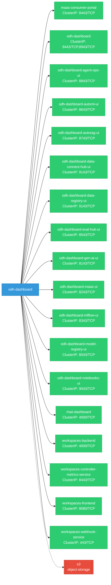

# odh-dashboard: Network

## Service Map

### Services

| Name | Type | Ports | Source |
|------|------|-------|--------|
| maas-consumer-portal | ClusterIP | 8443/TCP | [`manifests/distributions/maas-consumer-portal/service.yaml`](https://github.com/red-hat-data-services/odh-dashboard/blob/682ffb2d77733f59875f88e5000d18d795abb718/manifests/distributions/maas-consumer-portal/service.yaml) |
| odh-dashboard | ClusterIP | 8443/TCP, 8943/TCP | [`manifests/base/service.yaml`](https://github.com/red-hat-data-services/odh-dashboard/blob/682ffb2d77733f59875f88e5000d18d795abb718/manifests/base/service.yaml) |
| odh-dashboard-agent-ops-ui | ClusterIP | 8843/TCP | [`manifests/modules/agent-ops/service.yaml`](https://github.com/red-hat-data-services/odh-dashboard/blob/682ffb2d77733f59875f88e5000d18d795abb718/manifests/modules/agent-ops/service.yaml) |
| odh-dashboard-automl-ui | ClusterIP | 8643/TCP | [`manifests/modules/automl/service.yaml`](https://github.com/red-hat-data-services/odh-dashboard/blob/682ffb2d77733f59875f88e5000d18d795abb718/manifests/modules/automl/service.yaml) |
| odh-dashboard-autorag-ui | ClusterIP | 8743/TCP | [`manifests/modules/autorag/service.yaml`](https://github.com/red-hat-data-services/odh-dashboard/blob/682ffb2d77733f59875f88e5000d18d795abb718/manifests/modules/autorag/service.yaml) |
| odh-dashboard-data-connect-hub-ui | ClusterIP | 9143/TCP | [`manifests/modules/data-connect-hub/service.yaml`](https://github.com/red-hat-data-services/odh-dashboard/blob/682ffb2d77733f59875f88e5000d18d795abb718/manifests/modules/data-connect-hub/service.yaml) |
| odh-dashboard-data-registry-ui | ClusterIP | 9143/TCP | [`manifests/modules/data-registry/service.yaml`](https://github.com/red-hat-data-services/odh-dashboard/blob/682ffb2d77733f59875f88e5000d18d795abb718/manifests/modules/data-registry/service.yaml) |
| odh-dashboard-eval-hub-ui | ClusterIP | 8543/TCP | [`manifests/modules/eval-hub/service.yaml`](https://github.com/red-hat-data-services/odh-dashboard/blob/682ffb2d77733f59875f88e5000d18d795abb718/manifests/modules/eval-hub/service.yaml) |
| odh-dashboard-gen-ai-ui | ClusterIP | 8143/TCP | [`manifests/modules/gen-ai/service.yaml`](https://github.com/red-hat-data-services/odh-dashboard/blob/682ffb2d77733f59875f88e5000d18d795abb718/manifests/modules/gen-ai/service.yaml) |
| odh-dashboard-maas-ui | ClusterIP | 8243/TCP | [`manifests/modules/maas/service.yaml`](https://github.com/red-hat-data-services/odh-dashboard/blob/682ffb2d77733f59875f88e5000d18d795abb718/manifests/modules/maas/service.yaml) |
| odh-dashboard-mlflow-ui | ClusterIP | 8343/TCP | [`manifests/modules/mlflow/service.yaml`](https://github.com/red-hat-data-services/odh-dashboard/blob/682ffb2d77733f59875f88e5000d18d795abb718/manifests/modules/mlflow/service.yaml) |
| odh-dashboard-model-registry-ui | ClusterIP | 8043/TCP | [`manifests/modules/model-registry/service.yaml`](https://github.com/red-hat-data-services/odh-dashboard/blob/682ffb2d77733f59875f88e5000d18d795abb718/manifests/modules/model-registry/service.yaml) |
| odh-dashboard-notebooks-ui | ClusterIP | 9043/TCP | [`manifests/modules/notebooks/service.yaml`](https://github.com/red-hat-data-services/odh-dashboard/blob/682ffb2d77733f59875f88e5000d18d795abb718/manifests/modules/notebooks/service.yaml) |
| rhaii-dashboard | ClusterIP | 4000/TCP | [`distributions/core-bff/manifests/base/service.yaml`](https://github.com/red-hat-data-services/odh-dashboard/blob/682ffb2d77733f59875f88e5000d18d795abb718/distributions/core-bff/manifests/base/service.yaml) |
| workspaces-backend | ClusterIP | 4000/TCP | [`packages/notebooks/upstream/workspaces/backend/manifests/kustomize/base/service.yaml`](https://github.com/red-hat-data-services/odh-dashboard/blob/682ffb2d77733f59875f88e5000d18d795abb718/packages/notebooks/upstream/workspaces/backend/manifests/kustomize/base/service.yaml) |
| workspaces-controller-metrics-service | ClusterIP | 8443/TCP | [`packages/notebooks/upstream/workspaces/controller/manifests/kustomize/components/prometheus/service.yaml`](https://github.com/red-hat-data-services/odh-dashboard/blob/682ffb2d77733f59875f88e5000d18d795abb718/packages/notebooks/upstream/workspaces/controller/manifests/kustomize/components/prometheus/service.yaml) |
| workspaces-frontend | ClusterIP | 8080/TCP | [`packages/notebooks/upstream/workspaces/frontend/manifests/kustomize/base/service.yaml`](https://github.com/red-hat-data-services/odh-dashboard/blob/682ffb2d77733f59875f88e5000d18d795abb718/packages/notebooks/upstream/workspaces/frontend/manifests/kustomize/base/service.yaml) |
| workspaces-webhook-service | ClusterIP | 443/TCP | [`packages/notebooks/upstream/workspaces/controller/manifests/kustomize/base/webhook/service.yaml`](https://github.com/red-hat-data-services/odh-dashboard/blob/682ffb2d77733f59875f88e5000d18d795abb718/packages/notebooks/upstream/workspaces/controller/manifests/kustomize/base/webhook/service.yaml) |

### Ingress / Routing

| Kind | Name | Hosts | Paths | TLS | Source |
|------|------|-------|-------|-----|--------|
| Gateway | kubeflow-gateway |  |  | no | [`packages/notebooks/upstream/developing/manifests/istio-gateway/gateway.yaml`](https://github.com/red-hat-data-services/odh-dashboard/blob/682ffb2d77733f59875f88e5000d18d795abb718/packages/notebooks/upstream/developing/manifests/istio-gateway/gateway.yaml) |
| Gateway | kubeflow-gateway |  |  | no | [`packages/notebooks/upstream/testing/manifests/istio-gateway/gateway.yaml`](https://github.com/red-hat-data-services/odh-dashboard/blob/682ffb2d77733f59875f88e5000d18d795abb718/packages/notebooks/upstream/testing/manifests/istio-gateway/gateway.yaml) |
| HTTPRoute | maas-consumer-portal | gateway-domain | /maas-consumer-portal, /maas-consumer-portal | no | [`manifests/distributions/maas-consumer-portal/httproute.yaml`](https://github.com/red-hat-data-services/odh-dashboard/blob/682ffb2d77733f59875f88e5000d18d795abb718/manifests/distributions/maas-consumer-portal/httproute.yaml) |
| HTTPRoute | odh-dashboard |  | / | no | [`manifests/base/httproute.yaml`](https://github.com/red-hat-data-services/odh-dashboard/blob/682ffb2d77733f59875f88e5000d18d795abb718/manifests/base/httproute.yaml) |
| Route | rbac-inferred |  |  | no | [`rbac/odh-dashboard`](https://github.com/red-hat-data-services/odh-dashboard/blob/682ffb2d77733f59875f88e5000d18d795abb718/rbac/odh-dashboard) |

### Network Policies

| Name | Policy Types | Source |
|------|-------------|--------|
| agent-ops-allow-ports | Ingress, Egress | [`manifests/modules/agent-ops/networkpolicy.yaml`](https://github.com/red-hat-data-services/odh-dashboard/blob/682ffb2d77733f59875f88e5000d18d795abb718/manifests/modules/agent-ops/networkpolicy.yaml) |
| allow-prometheus-scrape | Ingress | [`packages/notebooks/upstream/workspaces/controller/manifests/kustomize/components/prometheus/network-policy.yaml`](https://github.com/red-hat-data-services/odh-dashboard/blob/682ffb2d77733f59875f88e5000d18d795abb718/packages/notebooks/upstream/workspaces/controller/manifests/kustomize/components/prometheus/network-policy.yaml) |
| automl-allow-ports | Ingress, Egress | [`manifests/modules/automl/networkpolicy.yaml`](https://github.com/red-hat-data-services/odh-dashboard/blob/682ffb2d77733f59875f88e5000d18d795abb718/manifests/modules/automl/networkpolicy.yaml) |
| autorag-allow-ports | Ingress, Egress | [`manifests/modules/autorag/networkpolicy.yaml`](https://github.com/red-hat-data-services/odh-dashboard/blob/682ffb2d77733f59875f88e5000d18d795abb718/manifests/modules/autorag/networkpolicy.yaml) |
| dashboard-perses-access | Ingress | [`manifests/observability/odh/network-policy.yaml`](https://github.com/red-hat-data-services/odh-dashboard/blob/682ffb2d77733f59875f88e5000d18d795abb718/manifests/observability/odh/network-policy.yaml) |
| dashboard-perses-access | Ingress | [`manifests/observability/rhoai/network-policy.yaml`](https://github.com/red-hat-data-services/odh-dashboard/blob/682ffb2d77733f59875f88e5000d18d795abb718/manifests/observability/rhoai/network-policy.yaml) |
| data-connect-hub-allow-ports | Ingress, Egress | [`manifests/modules/data-connect-hub/networkpolicy.yaml`](https://github.com/red-hat-data-services/odh-dashboard/blob/682ffb2d77733f59875f88e5000d18d795abb718/manifests/modules/data-connect-hub/networkpolicy.yaml) |
| data-registry-allow-ports | Ingress, Egress | [`manifests/modules/data-registry/networkpolicy.yaml`](https://github.com/red-hat-data-services/odh-dashboard/blob/682ffb2d77733f59875f88e5000d18d795abb718/manifests/modules/data-registry/networkpolicy.yaml) |
| default-deny-ingress | Ingress | [`packages/notebooks/upstream/workspaces/controller/manifests/kustomize/base/namespace/network-policy-default-deny.yaml`](https://github.com/red-hat-data-services/odh-dashboard/blob/682ffb2d77733f59875f88e5000d18d795abb718/packages/notebooks/upstream/workspaces/controller/manifests/kustomize/base/namespace/network-policy-default-deny.yaml) |
| eval-hub-allow-ports | Ingress, Egress | [`manifests/modules/eval-hub/networkpolicy.yaml`](https://github.com/red-hat-data-services/odh-dashboard/blob/682ffb2d77733f59875f88e5000d18d795abb718/manifests/modules/eval-hub/networkpolicy.yaml) |
| gen-ai-allow-ports | Ingress, Egress | [`manifests/modules/gen-ai/networkpolicy.yaml`](https://github.com/red-hat-data-services/odh-dashboard/blob/682ffb2d77733f59875f88e5000d18d795abb718/manifests/modules/gen-ai/networkpolicy.yaml) |
| maas-allow-ports | Ingress, Egress | [`manifests/modules/maas/networkpolicy.yaml`](https://github.com/red-hat-data-services/odh-dashboard/blob/682ffb2d77733f59875f88e5000d18d795abb718/manifests/modules/maas/networkpolicy.yaml) |
| maas-consumer-portal | Ingress, Egress | [`manifests/distributions/maas-consumer-portal/networkpolicy.yaml`](https://github.com/red-hat-data-services/odh-dashboard/blob/682ffb2d77733f59875f88e5000d18d795abb718/manifests/distributions/maas-consumer-portal/networkpolicy.yaml) |
| mlflow-allow-ports | Ingress, Egress | [`manifests/modules/mlflow/networkpolicy.yaml`](https://github.com/red-hat-data-services/odh-dashboard/blob/682ffb2d77733f59875f88e5000d18d795abb718/manifests/modules/mlflow/networkpolicy.yaml) |
| model-registry-allow-ports | Ingress, Egress | [`manifests/modules/model-registry/networkpolicy.yaml`](https://github.com/red-hat-data-services/odh-dashboard/blob/682ffb2d77733f59875f88e5000d18d795abb718/manifests/modules/model-registry/networkpolicy.yaml) |
| notebooks-allow-ports | Ingress, Egress | [`manifests/modules/notebooks/networkpolicy.yaml`](https://github.com/red-hat-data-services/odh-dashboard/blob/682ffb2d77733f59875f88e5000d18d795abb718/manifests/modules/notebooks/networkpolicy.yaml) |
| workspaces-backend | Ingress | [`packages/notebooks/upstream/workspaces/backend/manifests/kustomize/components/istio/network-policy.yaml`](https://github.com/red-hat-data-services/odh-dashboard/blob/682ffb2d77733f59875f88e5000d18d795abb718/packages/notebooks/upstream/workspaces/backend/manifests/kustomize/components/istio/network-policy.yaml) |
| workspaces-controller | Ingress | [`packages/notebooks/upstream/workspaces/controller/manifests/kustomize/components/istio/network-policy.yaml`](https://github.com/red-hat-data-services/odh-dashboard/blob/682ffb2d77733f59875f88e5000d18d795abb718/packages/notebooks/upstream/workspaces/controller/manifests/kustomize/components/istio/network-policy.yaml) |
| workspaces-controller | Ingress | [`packages/notebooks/upstream/workspaces/controller/manifests/kustomize/components/openshift-webhook/network-policy.yaml`](https://github.com/red-hat-data-services/odh-dashboard/blob/682ffb2d77733f59875f88e5000d18d795abb718/packages/notebooks/upstream/workspaces/controller/manifests/kustomize/components/openshift-webhook/network-policy.yaml) |
| workspaces-frontend | Ingress | [`packages/notebooks/upstream/workspaces/frontend/manifests/kustomize/components/istio/network-policy.yaml`](https://github.com/red-hat-data-services/odh-dashboard/blob/682ffb2d77733f59875f88e5000d18d795abb718/packages/notebooks/upstream/workspaces/frontend/manifests/kustomize/components/istio/network-policy.yaml) |

## Network Policy Graph

Visual representation of NetworkPolicy rules. Ingress rules show what traffic is allowed into pods, egress rules show what traffic is allowed out.

```mermaid
graph LR
    classDef policy fill:#e74c3c,stroke:#c0392b,color:#fff
    classDef pod fill:#3498db,stroke:#2980b9,color:#fff
    classDef external fill:#95a5a6,stroke:#7f8c8d,color:#fff

    odh_dashboard["odh-dashboard\nPods"]:::pod
    np_0_agent_ops_allow_ports{{"agent-ops-allow-ports\nIngress, Egress"}}:::policy
    np_0_agent_ops_allow_ports --> odh_dashboard
    np_1_allow_prometheus_scrape{{"allow-prometheus-scrape\nIngress"}}:::policy
    np_1_allow_prometheus_scrape --> odh_dashboard
    np_2_automl_allow_ports{{"automl-allow-ports\nIngress, Egress"}}:::policy
    np_2_automl_allow_ports --> odh_dashboard
    np_3_autorag_allow_ports{{"autorag-allow-ports\nIngress, Egress"}}:::policy
    np_3_autorag_allow_ports --> odh_dashboard
    np_4_dashboard_perses_access{{"dashboard-perses-access\nIngress"}}:::policy
    np_4_dashboard_perses_access --> odh_dashboard
    np_5_dashboard_perses_access{{"dashboard-perses-access\nIngress"}}:::policy
    np_5_dashboard_perses_access --> odh_dashboard
    np_6_data_connect_hub_allow_ports{{"data-connect-hub-allow-ports\nIngress, Egress"}}:::policy
    np_6_data_connect_hub_allow_ports --> odh_dashboard
    np_7_data_registry_allow_ports{{"data-registry-allow-ports\nIngress, Egress"}}:::policy
    np_7_data_registry_allow_ports --> odh_dashboard
    np_8_default_deny_ingress{{"default-deny-ingress\nIngress"}}:::policy
    np_8_default_deny_ingress --> odh_dashboard
    np_9_eval_hub_allow_ports{{"eval-hub-allow-ports\nIngress, Egress"}}:::policy
    np_9_eval_hub_allow_ports --> odh_dashboard
    np_10_gen_ai_allow_ports{{"gen-ai-allow-ports\nIngress, Egress"}}:::policy
    np_10_gen_ai_allow_ports --> odh_dashboard
    np_11_maas_allow_ports{{"maas-allow-ports\nIngress, Egress"}}:::policy
    np_11_maas_allow_ports --> odh_dashboard
    np_12_maas_consumer_portal{{"maas-consumer-portal\nIngress, Egress"}}:::policy
    np_12_maas_consumer_portal --> odh_dashboard
    np_13_mlflow_allow_ports{{"mlflow-allow-ports\nIngress, Egress"}}:::policy
    np_13_mlflow_allow_ports --> odh_dashboard
    np_14_model_registry_allow_ports{{"model-registry-allow-ports\nIngress, Egress"}}:::policy
    np_14_model_registry_allow_ports --> odh_dashboard
    np_15_notebooks_allow_ports{{"notebooks-allow-ports\nIngress, Egress"}}:::policy
    np_15_notebooks_allow_ports --> odh_dashboard
    np_16_workspaces_backend{{"workspaces-backend\nIngress"}}:::policy
    np_16_workspaces_backend --> odh_dashboard
    np_17_workspaces_controller{{"workspaces-controller\nIngress"}}:::policy
    np_17_workspaces_controller --> odh_dashboard
    np_18_workspaces_controller{{"workspaces-controller\nIngress"}}:::policy
    np_18_workspaces_controller --> odh_dashboard
    np_19_workspaces_frontend{{"workspaces-frontend\nIngress"}}:::policy
    np_19_workspaces_frontend --> odh_dashboard
```

