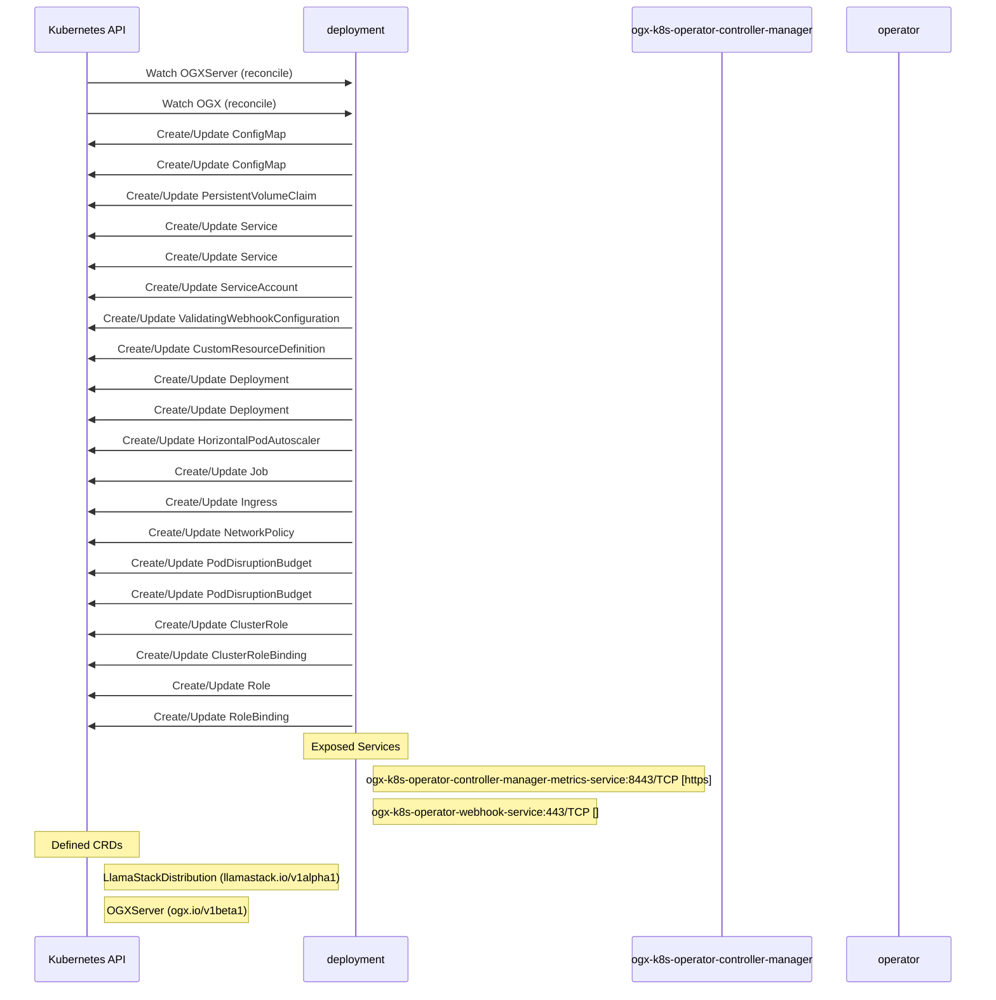

# ogx-k8s-operator: Dataflow

## Controller Watches

Kubernetes resources this controller monitors for changes. Each watch triggers reconciliation when the watched resource is created, updated, or deleted.

| Type | GVK | Source |
|------|-----|--------|
| For | api/v1beta1/OGXServer | [`controllers/ogxserver_controller.go:846`](https://github.com/ogx-ai/ogx-k8s-operator/blob/10e3e3214e20bc56209bf791808a7249b0f1457f/controllers/ogxserver_controller.go#L846) |
| For | apis/v1alpha1/OGX | [`ogx-module/internal/controller/ogx/reconciler.go:140`](https://github.com/ogx-ai/ogx-k8s-operator/blob/10e3e3214e20bc56209bf791808a7249b0f1457f/ogx-module/internal/controller/ogx/reconciler.go#L140) |
| Owns | /v1/ConfigMap | [`controllers/ogxserver_controller.go:853`](https://github.com/ogx-ai/ogx-k8s-operator/blob/10e3e3214e20bc56209bf791808a7249b0f1457f/controllers/ogxserver_controller.go#L853) |
| Owns | /v1/ConfigMap | [`ogx-module/internal/controller/ogx/reconciler.go:142`](https://github.com/ogx-ai/ogx-k8s-operator/blob/10e3e3214e20bc56209bf791808a7249b0f1457f/ogx-module/internal/controller/ogx/reconciler.go#L142) |
| Owns | /v1/PersistentVolumeClaim | [`controllers/ogxserver_controller.go:867`](https://github.com/ogx-ai/ogx-k8s-operator/blob/10e3e3214e20bc56209bf791808a7249b0f1457f/controllers/ogxserver_controller.go#L867) |
| Owns | /v1/Service | [`controllers/ogxserver_controller.go:852`](https://github.com/ogx-ai/ogx-k8s-operator/blob/10e3e3214e20bc56209bf791808a7249b0f1457f/controllers/ogxserver_controller.go#L852) |
| Owns | /v1/Service | [`ogx-module/internal/controller/ogx/reconciler.go:143`](https://github.com/ogx-ai/ogx-k8s-operator/blob/10e3e3214e20bc56209bf791808a7249b0f1457f/ogx-module/internal/controller/ogx/reconciler.go#L143) |
| Owns | /v1/ServiceAccount | [`ogx-module/internal/controller/ogx/reconciler.go:144`](https://github.com/ogx-ai/ogx-k8s-operator/blob/10e3e3214e20bc56209bf791808a7249b0f1457f/ogx-module/internal/controller/ogx/reconciler.go#L144) |
| Owns | admissionregistration.k8s.io/v1/ValidatingWebhookConfiguration | [`ogx-module/internal/controller/ogx/reconciler.go:150`](https://github.com/ogx-ai/ogx-k8s-operator/blob/10e3e3214e20bc56209bf791808a7249b0f1457f/ogx-module/internal/controller/ogx/reconciler.go#L150) |
| Owns | apiextensions.k8s.io/v1/CustomResourceDefinition | [`ogx-module/internal/controller/ogx/reconciler.go:151`](https://github.com/ogx-ai/ogx-k8s-operator/blob/10e3e3214e20bc56209bf791808a7249b0f1457f/ogx-module/internal/controller/ogx/reconciler.go#L151) |
| Owns | apps/v1/Deployment | [`controllers/ogxserver_controller.go:849`](https://github.com/ogx-ai/ogx-k8s-operator/blob/10e3e3214e20bc56209bf791808a7249b0f1457f/controllers/ogxserver_controller.go#L849) |
| Owns | apps/v1/Deployment | [`ogx-module/internal/controller/ogx/reconciler.go:141`](https://github.com/ogx-ai/ogx-k8s-operator/blob/10e3e3214e20bc56209bf791808a7249b0f1457f/ogx-module/internal/controller/ogx/reconciler.go#L141) |
| Owns | autoscaling/v2/HorizontalPodAutoscaler | [`controllers/ogxserver_controller.go:851`](https://github.com/ogx-ai/ogx-k8s-operator/blob/10e3e3214e20bc56209bf791808a7249b0f1457f/controllers/ogxserver_controller.go#L851) |
| Owns | batch/v1/Job | [`controllers/ogxserver_controller.go:854`](https://github.com/ogx-ai/ogx-k8s-operator/blob/10e3e3214e20bc56209bf791808a7249b0f1457f/controllers/ogxserver_controller.go#L854) |
| Owns | networking.k8s.io/v1/Ingress | [`controllers/ogxserver_controller.go:866`](https://github.com/ogx-ai/ogx-k8s-operator/blob/10e3e3214e20bc56209bf791808a7249b0f1457f/controllers/ogxserver_controller.go#L866) |
| Owns | networking.k8s.io/v1/NetworkPolicy | [`controllers/ogxserver_controller.go:865`](https://github.com/ogx-ai/ogx-k8s-operator/blob/10e3e3214e20bc56209bf791808a7249b0f1457f/controllers/ogxserver_controller.go#L865) |
| Owns | policy/v1/PodDisruptionBudget | [`ogx-module/internal/controller/ogx/reconciler.go:145`](https://github.com/ogx-ai/ogx-k8s-operator/blob/10e3e3214e20bc56209bf791808a7249b0f1457f/ogx-module/internal/controller/ogx/reconciler.go#L145) |
| Owns | policy/v1/PodDisruptionBudget | [`controllers/ogxserver_controller.go:850`](https://github.com/ogx-ai/ogx-k8s-operator/blob/10e3e3214e20bc56209bf791808a7249b0f1457f/controllers/ogxserver_controller.go#L850) |
| Owns | rbac.authorization.k8s.io/v1/ClusterRole | [`ogx-module/internal/controller/ogx/reconciler.go:148`](https://github.com/ogx-ai/ogx-k8s-operator/blob/10e3e3214e20bc56209bf791808a7249b0f1457f/ogx-module/internal/controller/ogx/reconciler.go#L148) |
| Owns | rbac.authorization.k8s.io/v1/ClusterRoleBinding | [`ogx-module/internal/controller/ogx/reconciler.go:149`](https://github.com/ogx-ai/ogx-k8s-operator/blob/10e3e3214e20bc56209bf791808a7249b0f1457f/ogx-module/internal/controller/ogx/reconciler.go#L149) |
| Owns | rbac.authorization.k8s.io/v1/Role | [`ogx-module/internal/controller/ogx/reconciler.go:146`](https://github.com/ogx-ai/ogx-k8s-operator/blob/10e3e3214e20bc56209bf791808a7249b0f1457f/ogx-module/internal/controller/ogx/reconciler.go#L146) |
| Owns | rbac.authorization.k8s.io/v1/RoleBinding | [`ogx-module/internal/controller/ogx/reconciler.go:147`](https://github.com/ogx-ai/ogx-k8s-operator/blob/10e3e3214e20bc56209bf791808a7249b0f1457f/ogx-module/internal/controller/ogx/reconciler.go#L147) |

### Programmatic Resource Operations

| Verb | Kind | Group | Condition |
|------|------|-------|----------|
| delete | ConfigMap |  |  |
| create | ConfigMap |  |  |
| patch | ConfigMap |  |  |

## Reconciliation Flow

How the controller interacts with the Kubernetes API during reconciliation.

### Webhooks

| Name | Type | Path | Failure Policy | Service | Overlays | Enable Condition | Sources |
|------|------|------|----------------|---------|----------|------------------|----------|
| vogxserver.kb.io | validating | /validate-ogx-io-v1beta1-ogxserver | Fail | opendatahub/ogx-k8s-operator-webhook-service | config/overlays/odh |  | [`config/webhook/manifests.yaml`](https://github.com/ogx-ai/ogx-k8s-operator/blob/10e3e3214e20bc56209bf791808a7249b0f1457f/config/webhook/manifests.yaml), [`kustomize:config/overlays/odh (ogx-k8s-operator-validating-webhook-configuration)`](https://github.com/ogx-ai/ogx-k8s-operator/blob/10e3e3214e20bc56209bf791808a7249b0f1457f/kustomize:config/overlays/odh %28ogx-k8s-operator-validating-webhook-configuration%29) |

## Configuration

ConfigMaps and Helm values that control this component's runtime behavior.

### ConfigMaps

| Name | Data Keys | Source |
|------|-----------|--------|
| config | platform-name | [`ogx-module/config/manager/configmap.yaml`](https://github.com/ogx-ai/ogx-k8s-operator/blob/10e3e3214e20bc56209bf791808a7249b0f1457f/ogx-module/config/manager/configmap.yaml) |

