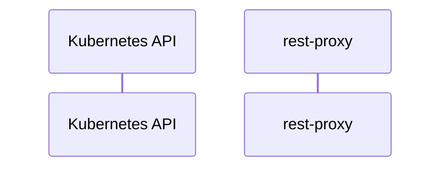

# rest-proxy: Dataflow

## Controller Watches

Kubernetes resources this controller monitors for changes. Each watch triggers reconciliation when the watched resource is created, updated, or deleted.

No controller watches found in analyzed sources.

## Reconciliation Flow

How the controller interacts with the Kubernetes API during reconciliation.

### HTTP Endpoints

| Method | Path | Source |
|--------|------|--------|
| * | GET | [`gen/grpc_predict_v2.pb.gw.go:340`](https://github.com/kserve/rest-proxy/blob/bfd2c035b295685061496846a04b5afc6151a1dc/gen/grpc_predict_v2.pb.gw.go#L340) |
| * | GET | [`gen/grpc_predict_v2.pb.gw.go:365`](https://github.com/kserve/rest-proxy/blob/bfd2c035b295685061496846a04b5afc6151a1dc/gen/grpc_predict_v2.pb.gw.go#L365) |
| * | GET | [`gen/grpc_predict_v2.pb.gw.go:481`](https://github.com/kserve/rest-proxy/blob/bfd2c035b295685061496846a04b5afc6151a1dc/gen/grpc_predict_v2.pb.gw.go#L481) |
| * | GET | [`gen/grpc_predict_v2.pb.gw.go:503`](https://github.com/kserve/rest-proxy/blob/bfd2c035b295685061496846a04b5afc6151a1dc/gen/grpc_predict_v2.pb.gw.go#L503) |
| * | POST | [`gen/grpc_predict_v2.pb.gw.go:390`](https://github.com/kserve/rest-proxy/blob/bfd2c035b295685061496846a04b5afc6151a1dc/gen/grpc_predict_v2.pb.gw.go#L390) |
| * | POST | [`gen/grpc_predict_v2.pb.gw.go:415`](https://github.com/kserve/rest-proxy/blob/bfd2c035b295685061496846a04b5afc6151a1dc/gen/grpc_predict_v2.pb.gw.go#L415) |
| * | POST | [`gen/grpc_predict_v2.pb.gw.go:525`](https://github.com/kserve/rest-proxy/blob/bfd2c035b295685061496846a04b5afc6151a1dc/gen/grpc_predict_v2.pb.gw.go#L525) |
| * | POST | [`gen/grpc_predict_v2.pb.gw.go:547`](https://github.com/kserve/rest-proxy/blob/bfd2c035b295685061496846a04b5afc6151a1dc/gen/grpc_predict_v2.pb.gw.go#L547) |

## Configuration

ConfigMaps and Helm values that control this component's runtime behavior.

