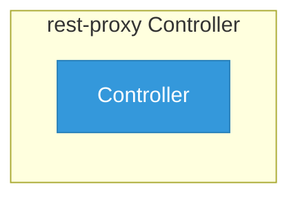

# rest-proxy

> **Architecture snapshot: 2026-09-07** (2026-09-07)

**Repository:** kserve/rest-proxy  
**Analyzer:** arch-analyzer dev  
**Extracted:** 2026-09-07T04:03:13Z

## Summary

| Metric | Count |
|--------|-------|
| CRDs | 0 |
| Deployments | 0 |
| Services | 0 |
| Secrets | 0 |
| Cluster Roles | 0 |
| Controller Watches | 0 |

## Component Architecture

CRDs, controllers, and owned Kubernetes resources.

### CRDs

No CRDs found in analyzed sources.

## Dependencies

### Key External Dependencies

| Module | Version |
|--------|---------|
| google.golang.org/grpc | v1.56.3 |
| sigs.k8s.io/controller-runtime | v0.14.1 |

