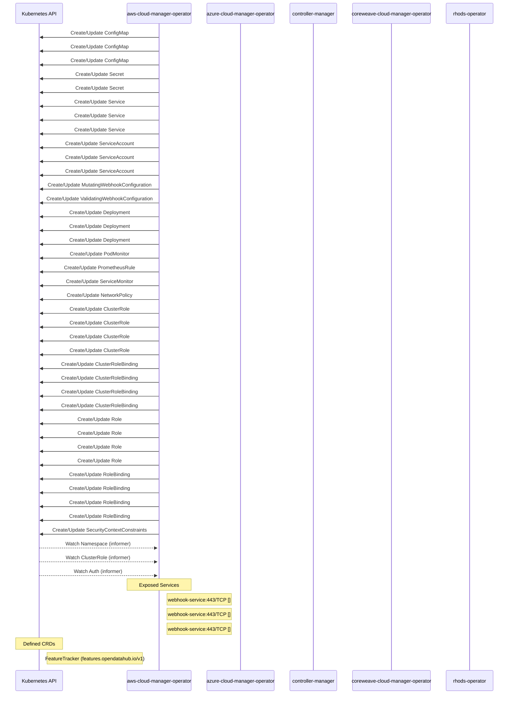

# rhods-operator: Dataflow

## Controller Watches

Kubernetes resources this controller monitors for changes. Each watch triggers reconciliation when the watched resource is created, updated, or deleted.

| Type | GVK | Source |
|------|-----|--------|
| Owns | /v1/ConfigMap | [`internal/controller/components/kueue/kueue_controller.go:63`](https://github.com/opendatahub-io/rhods-operator/blob/144e9359b70776e64856369aa79521f3b03e1978/internal/controller/components/kueue/kueue_controller.go#L63) |
| Owns | /v1/ConfigMap | [`internal/controller/components/trustyai/trustyai_controller.go:50`](https://github.com/opendatahub-io/rhods-operator/blob/144e9359b70776e64856369aa79521f3b03e1978/internal/controller/components/trustyai/trustyai_controller.go#L50) |
| Owns | /v1/ConfigMap | [`internal/controller/components/datasciencepipelines/datasciencepipelines_controller.go:48`](https://github.com/opendatahub-io/rhods-operator/blob/144e9359b70776e64856369aa79521f3b03e1978/internal/controller/components/datasciencepipelines/datasciencepipelines_controller.go#L48) |
| Owns | /v1/Secret | [`internal/controller/components/datasciencepipelines/datasciencepipelines_controller.go:49`](https://github.com/opendatahub-io/rhods-operator/blob/144e9359b70776e64856369aa79521f3b03e1978/internal/controller/components/datasciencepipelines/datasciencepipelines_controller.go#L49) |
| Owns | /v1/Secret | [`internal/controller/components/kueue/kueue_controller.go:64`](https://github.com/opendatahub-io/rhods-operator/blob/144e9359b70776e64856369aa79521f3b03e1978/internal/controller/components/kueue/kueue_controller.go#L64) |
| Owns | /v1/Service | [`internal/controller/components/kueue/kueue_controller.go:70`](https://github.com/opendatahub-io/rhods-operator/blob/144e9359b70776e64856369aa79521f3b03e1978/internal/controller/components/kueue/kueue_controller.go#L70) |
| Owns | /v1/Service | [`internal/controller/components/datasciencepipelines/datasciencepipelines_controller.go:55`](https://github.com/opendatahub-io/rhods-operator/blob/144e9359b70776e64856369aa79521f3b03e1978/internal/controller/components/datasciencepipelines/datasciencepipelines_controller.go#L55) |
| Owns | /v1/Service | [`internal/controller/components/trustyai/trustyai_controller.go:56`](https://github.com/opendatahub-io/rhods-operator/blob/144e9359b70776e64856369aa79521f3b03e1978/internal/controller/components/trustyai/trustyai_controller.go#L56) |
| Owns | /v1/ServiceAccount | [`internal/controller/components/kueue/kueue_controller.go:69`](https://github.com/opendatahub-io/rhods-operator/blob/144e9359b70776e64856369aa79521f3b03e1978/internal/controller/components/kueue/kueue_controller.go#L69) |
| Owns | /v1/ServiceAccount | [`internal/controller/components/trustyai/trustyai_controller.go:51`](https://github.com/opendatahub-io/rhods-operator/blob/144e9359b70776e64856369aa79521f3b03e1978/internal/controller/components/trustyai/trustyai_controller.go#L51) |
| Owns | /v1/ServiceAccount | [`internal/controller/components/datasciencepipelines/datasciencepipelines_controller.go:54`](https://github.com/opendatahub-io/rhods-operator/blob/144e9359b70776e64856369aa79521f3b03e1978/internal/controller/components/datasciencepipelines/datasciencepipelines_controller.go#L54) |
| Owns | admissionregistration.k8s.io/v1/MutatingWebhookConfiguration | [`internal/controller/components/kueue/kueue_controller.go:74`](https://github.com/opendatahub-io/rhods-operator/blob/144e9359b70776e64856369aa79521f3b03e1978/internal/controller/components/kueue/kueue_controller.go#L74) |
| Owns | admissionregistration.k8s.io/v1/ValidatingWebhookConfiguration | [`internal/controller/components/kueue/kueue_controller.go:75`](https://github.com/opendatahub-io/rhods-operator/blob/144e9359b70776e64856369aa79521f3b03e1978/internal/controller/components/kueue/kueue_controller.go#L75) |
| Owns | apps/v1/Deployment | [`internal/controller/components/datasciencepipelines/datasciencepipelines_controller.go:57`](https://github.com/opendatahub-io/rhods-operator/blob/144e9359b70776e64856369aa79521f3b03e1978/internal/controller/components/datasciencepipelines/datasciencepipelines_controller.go#L57) |
| Owns | apps/v1/Deployment | [`internal/controller/components/trustyai/trustyai_controller.go:57`](https://github.com/opendatahub-io/rhods-operator/blob/144e9359b70776e64856369aa79521f3b03e1978/internal/controller/components/trustyai/trustyai_controller.go#L57) |
| Owns | apps/v1/Deployment | [`internal/controller/components/kueue/kueue_controller.go:76`](https://github.com/opendatahub-io/rhods-operator/blob/144e9359b70776e64856369aa79521f3b03e1978/internal/controller/components/kueue/kueue_controller.go#L76) |
| Owns | monitoring/v1/PodMonitor | [`internal/controller/components/kueue/kueue_controller.go:72`](https://github.com/opendatahub-io/rhods-operator/blob/144e9359b70776e64856369aa79521f3b03e1978/internal/controller/components/kueue/kueue_controller.go#L72) |
| Owns | monitoring/v1/PrometheusRule | [`internal/controller/components/kueue/kueue_controller.go:73`](https://github.com/opendatahub-io/rhods-operator/blob/144e9359b70776e64856369aa79521f3b03e1978/internal/controller/components/kueue/kueue_controller.go#L73) |
| Owns | monitoring/v1/ServiceMonitor | [`internal/controller/components/datasciencepipelines/datasciencepipelines_controller.go:56`](https://github.com/opendatahub-io/rhods-operator/blob/144e9359b70776e64856369aa79521f3b03e1978/internal/controller/components/datasciencepipelines/datasciencepipelines_controller.go#L56) |
| Owns | networking.k8s.io/v1/NetworkPolicy | [`internal/controller/components/kueue/kueue_controller.go:71`](https://github.com/opendatahub-io/rhods-operator/blob/144e9359b70776e64856369aa79521f3b03e1978/internal/controller/components/kueue/kueue_controller.go#L71) |
| Owns | rbac.authorization.k8s.io/v1/ClusterRole | [`internal/controller/components/trustyai/trustyai_controller.go:53`](https://github.com/opendatahub-io/rhods-operator/blob/144e9359b70776e64856369aa79521f3b03e1978/internal/controller/components/trustyai/trustyai_controller.go#L53) |
| Owns | rbac.authorization.k8s.io/v1/ClusterRole | [`internal/controller/services/auth/auth_controller.go:60`](https://github.com/opendatahub-io/rhods-operator/blob/144e9359b70776e64856369aa79521f3b03e1978/internal/controller/services/auth/auth_controller.go#L60) |
| Owns | rbac.authorization.k8s.io/v1/ClusterRole | [`internal/controller/components/kueue/kueue_controller.go:66`](https://github.com/opendatahub-io/rhods-operator/blob/144e9359b70776e64856369aa79521f3b03e1978/internal/controller/components/kueue/kueue_controller.go#L66) |
| Owns | rbac.authorization.k8s.io/v1/ClusterRole | [`internal/controller/components/datasciencepipelines/datasciencepipelines_controller.go:51`](https://github.com/opendatahub-io/rhods-operator/blob/144e9359b70776e64856369aa79521f3b03e1978/internal/controller/components/datasciencepipelines/datasciencepipelines_controller.go#L51) |
| Owns | rbac.authorization.k8s.io/v1/ClusterRoleBinding | [`internal/controller/components/trustyai/trustyai_controller.go:52`](https://github.com/opendatahub-io/rhods-operator/blob/144e9359b70776e64856369aa79521f3b03e1978/internal/controller/components/trustyai/trustyai_controller.go#L52) |
| Owns | rbac.authorization.k8s.io/v1/ClusterRoleBinding | [`internal/controller/components/kueue/kueue_controller.go:65`](https://github.com/opendatahub-io/rhods-operator/blob/144e9359b70776e64856369aa79521f3b03e1978/internal/controller/components/kueue/kueue_controller.go#L65) |
| Owns | rbac.authorization.k8s.io/v1/ClusterRoleBinding | [`internal/controller/components/datasciencepipelines/datasciencepipelines_controller.go:50`](https://github.com/opendatahub-io/rhods-operator/blob/144e9359b70776e64856369aa79521f3b03e1978/internal/controller/components/datasciencepipelines/datasciencepipelines_controller.go#L50) |
| Owns | rbac.authorization.k8s.io/v1/ClusterRoleBinding | [`internal/controller/services/auth/auth_controller.go:59`](https://github.com/opendatahub-io/rhods-operator/blob/144e9359b70776e64856369aa79521f3b03e1978/internal/controller/services/auth/auth_controller.go#L59) |
| Owns | rbac.authorization.k8s.io/v1/Role | [`internal/controller/components/kueue/kueue_controller.go:67`](https://github.com/opendatahub-io/rhods-operator/blob/144e9359b70776e64856369aa79521f3b03e1978/internal/controller/components/kueue/kueue_controller.go#L67) |
| Owns | rbac.authorization.k8s.io/v1/Role | [`internal/controller/components/trustyai/trustyai_controller.go:54`](https://github.com/opendatahub-io/rhods-operator/blob/144e9359b70776e64856369aa79521f3b03e1978/internal/controller/components/trustyai/trustyai_controller.go#L54) |
| Owns | rbac.authorization.k8s.io/v1/Role | [`internal/controller/components/datasciencepipelines/datasciencepipelines_controller.go:52`](https://github.com/opendatahub-io/rhods-operator/blob/144e9359b70776e64856369aa79521f3b03e1978/internal/controller/components/datasciencepipelines/datasciencepipelines_controller.go#L52) |
| Owns | rbac.authorization.k8s.io/v1/Role | [`internal/controller/services/auth/auth_controller.go:61`](https://github.com/opendatahub-io/rhods-operator/blob/144e9359b70776e64856369aa79521f3b03e1978/internal/controller/services/auth/auth_controller.go#L61) |
| Owns | rbac.authorization.k8s.io/v1/RoleBinding | [`internal/controller/components/kueue/kueue_controller.go:68`](https://github.com/opendatahub-io/rhods-operator/blob/144e9359b70776e64856369aa79521f3b03e1978/internal/controller/components/kueue/kueue_controller.go#L68) |
| Owns | rbac.authorization.k8s.io/v1/RoleBinding | [`internal/controller/components/trustyai/trustyai_controller.go:55`](https://github.com/opendatahub-io/rhods-operator/blob/144e9359b70776e64856369aa79521f3b03e1978/internal/controller/components/trustyai/trustyai_controller.go#L55) |
| Owns | rbac.authorization.k8s.io/v1/RoleBinding | [`internal/controller/components/datasciencepipelines/datasciencepipelines_controller.go:53`](https://github.com/opendatahub-io/rhods-operator/blob/144e9359b70776e64856369aa79521f3b03e1978/internal/controller/components/datasciencepipelines/datasciencepipelines_controller.go#L53) |
| Owns | rbac.authorization.k8s.io/v1/RoleBinding | [`internal/controller/services/auth/auth_controller.go:62`](https://github.com/opendatahub-io/rhods-operator/blob/144e9359b70776e64856369aa79521f3b03e1978/internal/controller/services/auth/auth_controller.go#L62) |
| Owns | security/v1/SecurityContextConstraints | [`internal/controller/components/datasciencepipelines/datasciencepipelines_controller.go:58`](https://github.com/opendatahub-io/rhods-operator/blob/144e9359b70776e64856369aa79521f3b03e1978/internal/controller/components/datasciencepipelines/datasciencepipelines_controller.go#L58) |
| Watches | /v1/Namespace | [`internal/controller/components/kueue/kueue_controller.go:150`](https://github.com/opendatahub-io/rhods-operator/blob/144e9359b70776e64856369aa79521f3b03e1978/internal/controller/components/kueue/kueue_controller.go#L150) |
| Watches | rbac.authorization.k8s.io/v1/ClusterRole | [`internal/controller/components/kueue/kueue_controller.go:144`](https://github.com/opendatahub-io/rhods-operator/blob/144e9359b70776e64856369aa79521f3b03e1978/internal/controller/components/kueue/kueue_controller.go#L144) |
| Watches | services/v1alpha1/Auth | [`internal/controller/components/kueue/kueue_controller.go:161`](https://github.com/opendatahub-io/rhods-operator/blob/144e9359b70776e64856369aa79521f3b03e1978/internal/controller/components/kueue/kueue_controller.go#L161) |

### Programmatic Resource Operations

| Verb | Kind | Group | Condition |
|------|------|-------|----------|
| update | DSCInitialization | dscinitialization |  |
| delete | FeatureTracker | features |  |

## Reconciliation Flow

How the controller interacts with the Kubernetes API during reconciliation.

### Webhooks

| Name | Type | Path | Failure Policy | Service | Overlays | Enable Condition | Sources |
|------|------|------|----------------|---------|----------|------------------|----------|
| Defaulter-webhook | mutating | /mutate-datasciencecluster-v2 |  |  |  |  |  |
| Defaulter-webhook | mutating | /mutate-datasciencecluster-v1 |  |  |  |  |  |
| Injector-webhook | mutating | /mutate-prometheus-monitors |  |  |  |  |  |
| Validator-webhook | validating | /validate-datasciencecluster-v2 |  |  |  |  |  |
| Validator-webhook | validating | /validate-dscinitialization-v1 |  |  |  |  |  |
| Validator-webhook | validating | /validate-dscinitialization-v2 |  |  |  |  |  |
| Validator-webhook | validating | /validate-datasciencecluster-v1 |  |  |  |  |  |
| conversion-unknown | conversion | /convert |  | system/webhook-service |  | .ManagementState == operatorv1.Managed &amp;&amp; .ManagementState == "" | [`config/crd/patches/webhook_in_datasciencecluster_datascienceclusters.yaml`](https://github.com/opendatahub-io/rhods-operator/blob/144e9359b70776e64856369aa79521f3b03e1978/config/crd/patches/webhook_in_datasciencecluster_datascienceclusters.yaml) |
| conversion-unknown | conversion | /convert |  | system/webhook-service |  | .ManagementState == operatorv1.Managed &amp;&amp; .ManagementState == "" | [`config/crd/patches/webhook_in_dscinitialization_dscinitializations.yaml`](https://github.com/opendatahub-io/rhods-operator/blob/144e9359b70776e64856369aa79521f3b03e1978/config/crd/patches/webhook_in_dscinitialization_dscinitializations.yaml) |
| conversion-unknown | conversion | /convert |  | system/webhook-service |  | .ManagementState == operatorv1.Managed &amp;&amp; .ManagementState == "" | [`config/crd/patches/webhook_in_services_auths.yaml`](https://github.com/opendatahub-io/rhods-operator/blob/144e9359b70776e64856369aa79521f3b03e1978/config/crd/patches/webhook_in_services_auths.yaml) |

#### Defaulter-webhook Behavior

| Field | Operation | Condition |
|-------|-----------|----------|
| registriesNamespace | set | modelRegistry.ManagementState == operatorv1.Managed &amp;&amp; modelRegistry.RegistriesNamespace == "" |
| nim.managementState | set | kserve.ManagementState == operatorv1.Managed &amp;&amp; kserve.NIM.ManagementState == "" |

#### Defaulter-webhook Behavior

| Field | Operation | Condition |
|-------|-----------|----------|
| registriesNamespace | set | modelRegistry.ManagementState == operatorv1.Managed &amp;&amp; modelRegistry.RegistriesNamespace == "" |
| nim.managementState | set | kserve.ManagementState == operatorv1.Managed &amp;&amp; kserve.NIM.ManagementState == "" |

## Configuration

ConfigMaps and Helm values that control this component's runtime behavior.

