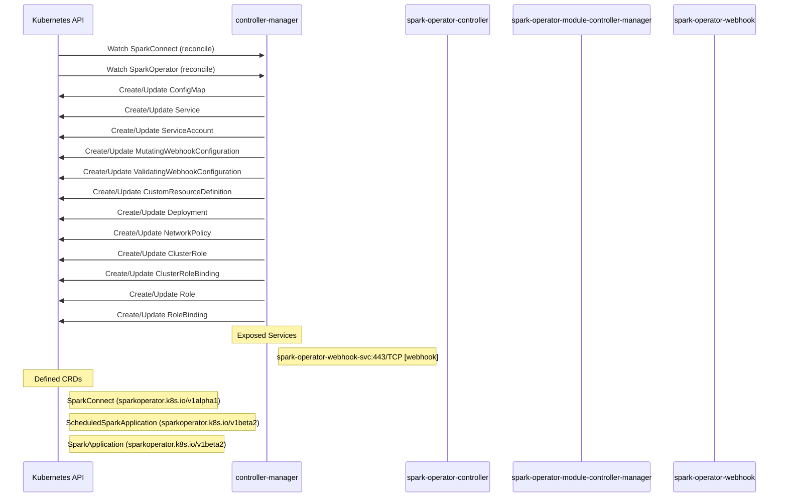

# spark-operator: Dataflow

## Controller Watches

Kubernetes resources this controller monitors for changes. Each watch triggers reconciliation when the watched resource is created, updated, or deleted.

| Type | GVK | Source |
|------|-----|--------|
| For | api/v1alpha1/SparkConnect | [`internal/controller/sparkconnect/reconciler.go:111`](https://github.com/kubeflow/spark-operator/blob/31bb82c09e1f7240d193625af0e87b3a042fb5fa/internal/controller/sparkconnect/reconciler.go#L111) |
| For | apis/v1alpha1/SparkOperator | [`spark-operator-module/pkg/sparkoperatormodule/setup.go:21`](https://github.com/kubeflow/spark-operator/blob/31bb82c09e1f7240d193625af0e87b3a042fb5fa/spark-operator-module/pkg/sparkoperatormodule/setup.go#L21) |
| Owns | /v1/ConfigMap | [`spark-operator-module/pkg/sparkoperatormodule/setup.go:22`](https://github.com/kubeflow/spark-operator/blob/31bb82c09e1f7240d193625af0e87b3a042fb5fa/spark-operator-module/pkg/sparkoperatormodule/setup.go#L22) |
| Owns | /v1/Service | [`spark-operator-module/pkg/sparkoperatormodule/setup.go:23`](https://github.com/kubeflow/spark-operator/blob/31bb82c09e1f7240d193625af0e87b3a042fb5fa/spark-operator-module/pkg/sparkoperatormodule/setup.go#L23) |
| Owns | /v1/ServiceAccount | [`spark-operator-module/pkg/sparkoperatormodule/setup.go:24`](https://github.com/kubeflow/spark-operator/blob/31bb82c09e1f7240d193625af0e87b3a042fb5fa/spark-operator-module/pkg/sparkoperatormodule/setup.go#L24) |
| Owns | admissionregistration.k8s.io/v1/MutatingWebhookConfiguration | [`spark-operator-module/pkg/sparkoperatormodule/setup.go:31`](https://github.com/kubeflow/spark-operator/blob/31bb82c09e1f7240d193625af0e87b3a042fb5fa/spark-operator-module/pkg/sparkoperatormodule/setup.go#L31) |
| Owns | admissionregistration.k8s.io/v1/ValidatingWebhookConfiguration | [`spark-operator-module/pkg/sparkoperatormodule/setup.go:32`](https://github.com/kubeflow/spark-operator/blob/31bb82c09e1f7240d193625af0e87b3a042fb5fa/spark-operator-module/pkg/sparkoperatormodule/setup.go#L32) |
| Owns | apiextensions.k8s.io/v1/CustomResourceDefinition | [`spark-operator-module/pkg/sparkoperatormodule/setup.go:33`](https://github.com/kubeflow/spark-operator/blob/31bb82c09e1f7240d193625af0e87b3a042fb5fa/spark-operator-module/pkg/sparkoperatormodule/setup.go#L33) |
| Owns | apps/v1/Deployment | [`spark-operator-module/pkg/sparkoperatormodule/setup.go:25`](https://github.com/kubeflow/spark-operator/blob/31bb82c09e1f7240d193625af0e87b3a042fb5fa/spark-operator-module/pkg/sparkoperatormodule/setup.go#L25) |
| Owns | networking.k8s.io/v1/NetworkPolicy | [`spark-operator-module/pkg/sparkoperatormodule/setup.go:26`](https://github.com/kubeflow/spark-operator/blob/31bb82c09e1f7240d193625af0e87b3a042fb5fa/spark-operator-module/pkg/sparkoperatormodule/setup.go#L26) |
| Owns | rbac.authorization.k8s.io/v1/ClusterRole | [`spark-operator-module/pkg/sparkoperatormodule/setup.go:29`](https://github.com/kubeflow/spark-operator/blob/31bb82c09e1f7240d193625af0e87b3a042fb5fa/spark-operator-module/pkg/sparkoperatormodule/setup.go#L29) |
| Owns | rbac.authorization.k8s.io/v1/ClusterRoleBinding | [`spark-operator-module/pkg/sparkoperatormodule/setup.go:30`](https://github.com/kubeflow/spark-operator/blob/31bb82c09e1f7240d193625af0e87b3a042fb5fa/spark-operator-module/pkg/sparkoperatormodule/setup.go#L30) |
| Owns | rbac.authorization.k8s.io/v1/Role | [`spark-operator-module/pkg/sparkoperatormodule/setup.go:27`](https://github.com/kubeflow/spark-operator/blob/31bb82c09e1f7240d193625af0e87b3a042fb5fa/spark-operator-module/pkg/sparkoperatormodule/setup.go#L27) |
| Owns | rbac.authorization.k8s.io/v1/RoleBinding | [`spark-operator-module/pkg/sparkoperatormodule/setup.go:28`](https://github.com/kubeflow/spark-operator/blob/31bb82c09e1f7240d193625af0e87b3a042fb5fa/spark-operator-module/pkg/sparkoperatormodule/setup.go#L28) |

### Programmatic Resource Operations

| Verb | Kind | Group | Condition |
|------|------|-------|----------|
| delete | SparkApplication | api |  |

## Reconciliation Flow

How the controller interacts with the Kubernetes API during reconciliation.

### Webhooks

| Name | Type | Path | Failure Policy | Service | Overlays | Enable Condition | Sources |
|------|------|------|----------------|---------|----------|------------------|----------|
| conversion-unknown | conversion | /convert |  | system/spark-operator-webhook-svc |  |  | [`config/crd/patches/webhook_in_scheduledsparkapplications.yaml`](https://github.com/kubeflow/spark-operator/blob/31bb82c09e1f7240d193625af0e87b3a042fb5fa/config/crd/patches/webhook_in_scheduledsparkapplications.yaml) |
| conversion-unknown | conversion | /convert |  | system/spark-operator-webhook-svc |  |  | [`config/crd/patches/webhook_in_sparkapplications.yaml`](https://github.com/kubeflow/spark-operator/blob/31bb82c09e1f7240d193625af0e87b3a042fb5fa/config/crd/patches/webhook_in_sparkapplications.yaml) |
| conversion-unknown | conversion | /convert |  | system/spark-operator-webhook-svc |  |  | [`config/crd/patches/webhook_in_sparkconnects.yaml`](https://github.com/kubeflow/spark-operator/blob/31bb82c09e1f7240d193625af0e87b3a042fb5fa/config/crd/patches/webhook_in_sparkconnects.yaml) |
| mutate-pod.sparkoperator.k8s.io | mutating | /mutate--v1-pod | Fail | opendatahub/spark-operator-webhook-svc | config/overlays/odh |  | [`config/webhook/manifests.yaml`](https://github.com/kubeflow/spark-operator/blob/31bb82c09e1f7240d193625af0e87b3a042fb5fa/config/webhook/manifests.yaml), [`kustomize:config/overlays/odh (mutating-webhook-configuration)`](https://github.com/kubeflow/spark-operator/blob/31bb82c09e1f7240d193625af0e87b3a042fb5fa/kustomize:config/overlays/odh %28mutating-webhook-configuration%29) |
| mutate-scheduledsparkapplication.sparkoperator.k8s.io | mutating | /mutate-sparkoperator-k8s-io-v1beta2-scheduledsparkapplication | Fail | opendatahub/spark-operator-webhook-svc | config/overlays/odh |  | [`config/webhook/manifests.yaml`](https://github.com/kubeflow/spark-operator/blob/31bb82c09e1f7240d193625af0e87b3a042fb5fa/config/webhook/manifests.yaml), [`kustomize:config/overlays/odh (mutating-webhook-configuration)`](https://github.com/kubeflow/spark-operator/blob/31bb82c09e1f7240d193625af0e87b3a042fb5fa/kustomize:config/overlays/odh %28mutating-webhook-configuration%29) |
| mutate-sparkapplication.sparkoperator.k8s.io | mutating | /mutate-sparkoperator-k8s-io-v1beta2-sparkapplication | Fail | opendatahub/spark-operator-webhook-svc | config/overlays/odh |  | [`config/webhook/manifests.yaml`](https://github.com/kubeflow/spark-operator/blob/31bb82c09e1f7240d193625af0e87b3a042fb5fa/config/webhook/manifests.yaml), [`kustomize:config/overlays/odh (mutating-webhook-configuration)`](https://github.com/kubeflow/spark-operator/blob/31bb82c09e1f7240d193625af0e87b3a042fb5fa/kustomize:config/overlays/odh %28mutating-webhook-configuration%29) |
| mutate-sparkconnect.sparkoperator.k8s.io | mutating | /mutate-sparkoperator-k8s-io-v1alpha1-sparkconnect | Fail | opendatahub/spark-operator-webhook-svc | config/overlays/odh |  | [`config/webhook/manifests.yaml`](https://github.com/kubeflow/spark-operator/blob/31bb82c09e1f7240d193625af0e87b3a042fb5fa/config/webhook/manifests.yaml), [`kustomize:config/overlays/odh (mutating-webhook-configuration)`](https://github.com/kubeflow/spark-operator/blob/31bb82c09e1f7240d193625af0e87b3a042fb5fa/kustomize:config/overlays/odh %28mutating-webhook-configuration%29) |
| validate-scheduledsparkapplication.sparkoperator.k8s.io | validating | /validate-sparkoperator-k8s-io-v1beta2-scheduledsparkapplication | Fail | opendatahub/spark-operator-webhook-svc | config/overlays/odh |  | [`config/webhook/manifests.yaml`](https://github.com/kubeflow/spark-operator/blob/31bb82c09e1f7240d193625af0e87b3a042fb5fa/config/webhook/manifests.yaml), [`kustomize:config/overlays/odh (validating-webhook-configuration)`](https://github.com/kubeflow/spark-operator/blob/31bb82c09e1f7240d193625af0e87b3a042fb5fa/kustomize:config/overlays/odh %28validating-webhook-configuration%29) |
| validate-sparkapplication.sparkoperator.k8s.io | validating | /validate-sparkoperator-k8s-io-v1beta2-sparkapplication | Fail | opendatahub/spark-operator-webhook-svc | config/overlays/odh |  | [`config/webhook/manifests.yaml`](https://github.com/kubeflow/spark-operator/blob/31bb82c09e1f7240d193625af0e87b3a042fb5fa/config/webhook/manifests.yaml), [`kustomize:config/overlays/odh (validating-webhook-configuration)`](https://github.com/kubeflow/spark-operator/blob/31bb82c09e1f7240d193625af0e87b3a042fb5fa/kustomize:config/overlays/odh %28validating-webhook-configuration%29) |
| validate-sparkconnect.sparkoperator.k8s.io | validating | /validate-sparkoperator-k8s-io-v1alpha1-sparkconnect | Fail | opendatahub/spark-operator-webhook-svc | config/overlays/odh |  | [`config/webhook/manifests.yaml`](https://github.com/kubeflow/spark-operator/blob/31bb82c09e1f7240d193625af0e87b3a042fb5fa/config/webhook/manifests.yaml), [`kustomize:config/overlays/odh (validating-webhook-configuration)`](https://github.com/kubeflow/spark-operator/blob/31bb82c09e1f7240d193625af0e87b3a042fb5fa/kustomize:config/overlays/odh %28validating-webhook-configuration%29) |

## Configuration

ConfigMaps and Helm values that control this component's runtime behavior.

### Helm

**Chart:** spark-operator v2.5.0-rc.0

