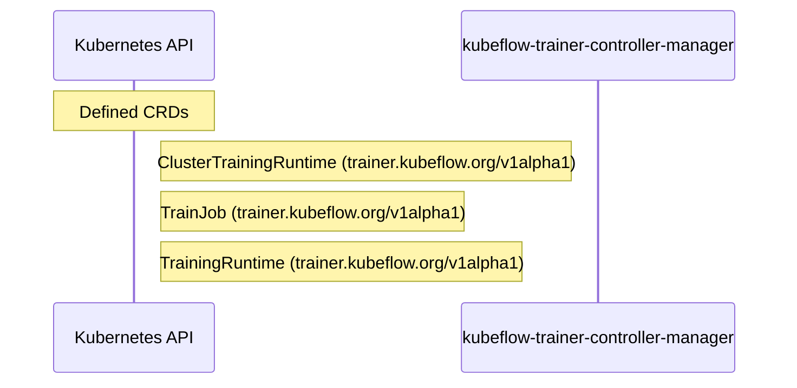

# trainer: Dataflow

## Controller Watches

Kubernetes resources this controller monitors for changes. Each watch triggers reconciliation when the watched resource is created, updated, or deleted.

| Type | GVK | Source |
|------|-----|--------|

### Programmatic Resource Operations

| Verb | Kind | Group | Condition |
|------|------|-------|----------|
| patch | ClusterTrainingRuntime | trainer |  |
| patch | TrainingRuntime | trainer |  |
| patch | TrainJob | trainer |  |
| delete | JobSet | jobset |  |

## Reconciliation Flow

How the controller interacts with the Kubernetes API during reconciliation.

### Webhooks

| Name | Type | Path | Failure Policy | Service | Overlays | Enable Condition | Sources |
|------|------|------|----------------|---------|----------|------------------|----------|
| ClusterTrainingRuntimeValidator-webhook | validating | /validate-trainer-kubeflow-org-v1alpha1-clustertrainingruntime |  |  |  |  |  |
| TrainJobDefaulter-webhook | mutating | /mutate-trainer-kubeflow-org-v1alpha1-trainjob |  |  |  |  |  |
| TrainJobValidator-webhook | validating | /validate-trainer-kubeflow-org-v1alpha1-trainjob |  |  |  |  |  |
| TrainingRuntimeValidator-webhook | validating | /validate-trainer-kubeflow-org-v1alpha1-trainingruntime |  |  |  |  |  |

#### TrainJobDefaulter-webhook Behavior

| Field | Operation | Condition |
|-------|-----------|----------|
| time | set | ok |

### HTTP Endpoints

| Method | Path | Source |
|--------|------|--------|
| * | / | [`pkg/statusserver/server.go:88`](https://github.com/kubeflow/trainer/blob/6d6b623b4f54315b09d597b438e2daf911e20fb2/pkg/statusserver/server.go#L88) |
| * | POST  | [`pkg/statusserver/server.go:87`](https://github.com/kubeflow/trainer/blob/6d6b623b4f54315b09d597b438e2daf911e20fb2/pkg/statusserver/server.go#L87) |

## Configuration

ConfigMaps and Helm values that control this component's runtime behavior.

### Helm

**Chart:** kubeflow-trainer v2.3.0-rc.3

