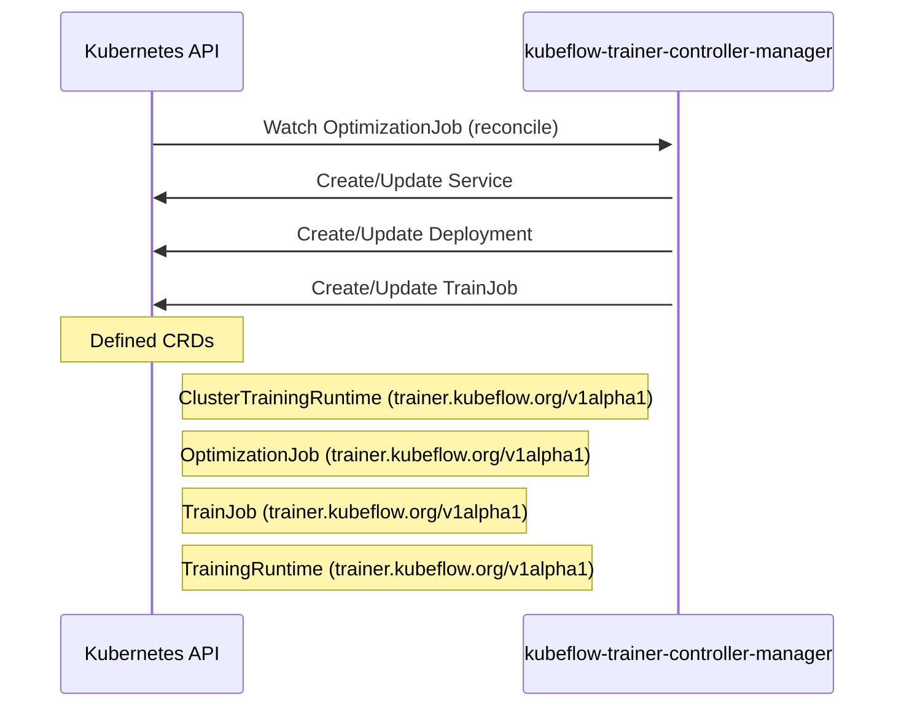

# trainer: Dataflow

## Controller Watches

Kubernetes resources this controller monitors for changes. Each watch triggers reconciliation when the watched resource is created, updated, or deleted.

| Type | GVK | Source |
|------|-----|--------|
| For | trainer/v1alpha1/OptimizationJob | [`pkg/controller/optimizationjob_controller.go:447`](https://github.com/kubeflow/trainer/blob/3a92cc92023fe5478ebf78193f63c9ca94c64e09/pkg/controller/optimizationjob_controller.go#L447) |
| Owns | /v1/Service | [`pkg/controller/optimizationjob_controller.go:450`](https://github.com/kubeflow/trainer/blob/3a92cc92023fe5478ebf78193f63c9ca94c64e09/pkg/controller/optimizationjob_controller.go#L450) |
| Owns | apps/v1/Deployment | [`pkg/controller/optimizationjob_controller.go:449`](https://github.com/kubeflow/trainer/blob/3a92cc92023fe5478ebf78193f63c9ca94c64e09/pkg/controller/optimizationjob_controller.go#L449) |
| Owns | trainer/v1alpha1/TrainJob | [`pkg/controller/optimizationjob_controller.go:448`](https://github.com/kubeflow/trainer/blob/3a92cc92023fe5478ebf78193f63c9ca94c64e09/pkg/controller/optimizationjob_controller.go#L448) |

### Programmatic Resource Operations

| Verb | Kind | Group | Condition |
|------|------|-------|----------|
| patch | ClusterTrainingRuntime | trainer |  |
| patch | OptimizationJob | trainer |  |
| patch | TrainingRuntime | trainer |  |
| patch | TrainJob | trainer |  |
| delete | JobSet | jobset |  |

## Reconciliation Flow

How the controller interacts with the Kubernetes API during reconciliation.

```mermaid
sequenceDiagram
    %% Static dataflow for trainer

    participant KubernetesAPI as Kubernetes API
    participant kubeflow_trainer_controller_manager as kubeflow-trainer-controller-manager

    KubernetesAPI->>+kubeflow_trainer_controller_manager: Watch OptimizationJob (reconcile)
    kubeflow_trainer_controller_manager->>KubernetesAPI: Create/Update Service
    kubeflow_trainer_controller_manager->>KubernetesAPI: Create/Update Deployment
    kubeflow_trainer_controller_manager->>KubernetesAPI: Create/Update TrainJob

    Note over KubernetesAPI: Defined CRDs
    Note right of KubernetesAPI: ClusterTrainingRuntime (trainer.kubeflow.org/v1alpha1)
    Note right of KubernetesAPI: OptimizationJob (trainer.kubeflow.org/v1alpha1)
    Note right of KubernetesAPI: TrainJob (trainer.kubeflow.org/v1alpha1)
    Note right of KubernetesAPI: TrainingRuntime (trainer.kubeflow.org/v1alpha1)
```

### Webhooks

| Name | Type | Path | Failure Policy | Service | Overlays | Enable Condition | Sources |
|------|------|------|----------------|---------|----------|------------------|----------|
| ClusterTrainingRuntimeValidator-webhook | validating | /validate-trainer-kubeflow-org-v1alpha1-clustertrainingruntime |  |  |  |  |  |
| TrainJobDefaulter-webhook | mutating | /mutate-trainer-kubeflow-org-v1alpha1-trainjob |  |  |  |  |  |
| TrainJobValidator-webhook | validating | /validate-trainer-kubeflow-org-v1alpha1-trainjob |  |  |  |  |  |
| TrainingRuntimeValidator-webhook | validating | /validate-trainer-kubeflow-org-v1alpha1-trainingruntime |  |  |  |  |  |

#### TrainJobDefaulter-webhook Behavior

| Field | Operation | Condition |
|-------|-----------|----------|
| time | set | ok |

### HTTP Endpoints

| Method | Path | Source |
|--------|------|--------|
| * | / | [`pkg/statusserver/server.go:89`](https://github.com/kubeflow/trainer/blob/3a92cc92023fe5478ebf78193f63c9ca94c64e09/pkg/statusserver/server.go#L89) |
| * | POST  | [`pkg/statusserver/server.go:88`](https://github.com/kubeflow/trainer/blob/3a92cc92023fe5478ebf78193f63c9ca94c64e09/pkg/statusserver/server.go#L88) |

## Configuration

ConfigMaps and Helm values that control this component's runtime behavior.

### Helm

**Chart:** kubeflow-trainer v2.3.0

