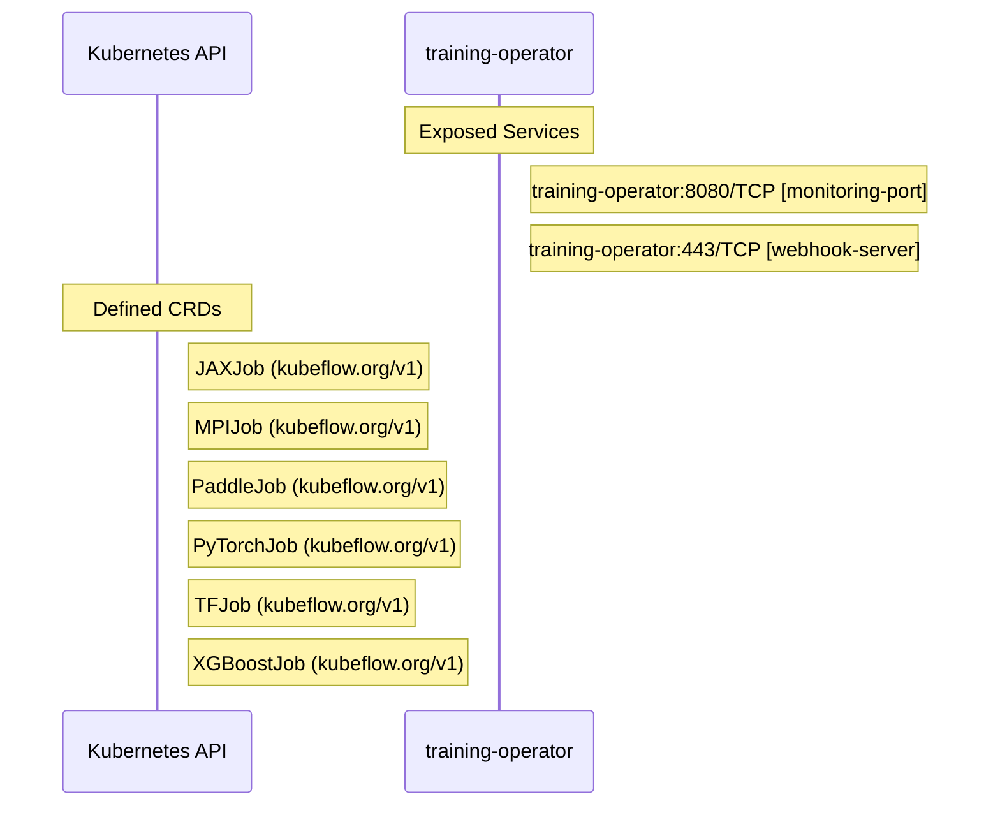

# training-operator: Dataflow

## Controller Watches

Kubernetes resources this controller monitors for changes. Each watch triggers reconciliation when the watched resource is created, updated, or deleted.

| Type | GVK | Source |
|------|-----|--------|

### Programmatic Resource Operations

| Verb | Kind | Group | Condition |
|------|------|-------|----------|
| create | Pod |  |  |
| create | HorizontalPodAutoscaler | autoscaling |  |
| delete | HorizontalPodAutoscaler | autoscaling |  |
| update | HorizontalPodAutoscaler | autoscaling |  |

## Reconciliation Flow

How the controller interacts with the Kubernetes API during reconciliation.

### Webhooks

| Name | Type | Path | Failure Policy | Service | Overlays | Enable Condition | Sources |
|------|------|------|----------------|---------|----------|------------------|----------|
| Webhook-webhook | validating | /validate-kubeflow-org-v1-pytorchjob |  |  |  |  |  |
| Webhook-webhook | validating | /validate-kubeflow-org-v1-tfjob |  |  |  |  |  |
| Webhook-webhook | validating | /validate-kubeflow-org-v1-xgboostjob |  |  |  |  |  |
| Webhook-webhook | validating | /validate-kubeflow-org-v1-jaxjob |  |  |  |  |  |
| Webhook-webhook | validating | /validate-kubeflow-org-v1-paddlejob |  |  |  |  |  |

## Configuration

ConfigMaps and Helm values that control this component's runtime behavior.

