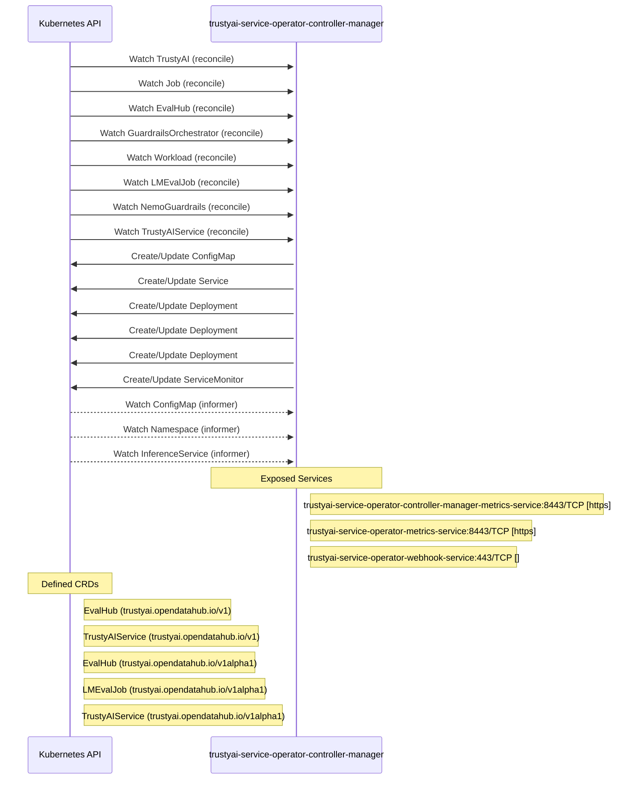

# trustyai-service-operator: Dataflow

## Controller Watches

Kubernetes resources this controller monitors for changes. Each watch triggers reconciliation when the watched resource is created, updated, or deleted.

| Type | GVK | Source |
|------|-----|--------|
| For | apis/v1alpha1/TrustyAI | [`trustyai-operator-module/pkg/trustyaimodule/reconciler.go:416`](https://github.com/trustyai-explainability/trustyai-service-operator/blob/870559ac1034accf95ac655072444bf28d36ca19/trustyai-operator-module/pkg/trustyaimodule/reconciler.go#L416) |
| For | batch/v1/Job | [`controllers/evalhub/evaluation_job_failure_reconciler.go:204`](https://github.com/trustyai-explainability/trustyai-service-operator/blob/870559ac1034accf95ac655072444bf28d36ca19/controllers/evalhub/evaluation_job_failure_reconciler.go#L204) |
| For | evalhub/v1/EvalHub | [`controllers/evalhub/evalhub_controller.go:370`](https://github.com/trustyai-explainability/trustyai-service-operator/blob/870559ac1034accf95ac655072444bf28d36ca19/controllers/evalhub/evalhub_controller.go#L370) |
| For | gorch/v1alpha1/GuardrailsOrchestrator | [`controllers/gorch/guardrailsorchestrator_controller.go:410`](https://github.com/trustyai-explainability/trustyai-service-operator/blob/870559ac1034accf95ac655072444bf28d36ca19/controllers/gorch/guardrailsorchestrator_controller.go#L410) |
| For | kueue/v1beta1/Workload | [`controllers/evalhub/evaluation_failed_kueue_workloads_reconciler.go:90`](https://github.com/trustyai-explainability/trustyai-service-operator/blob/870559ac1034accf95ac655072444bf28d36ca19/controllers/evalhub/evaluation_failed_kueue_workloads_reconciler.go#L90) |
| For | lmes/v1alpha1/LMEvalJob | [`controllers/lmes/lmevaljob_controller.go:341`](https://github.com/trustyai-explainability/trustyai-service-operator/blob/870559ac1034accf95ac655072444bf28d36ca19/controllers/lmes/lmevaljob_controller.go#L341) |
| For | nemo_guardrails/v1alpha1/NemoGuardrails | [`controllers/nemo_guardrails/nemoguardrail_controller.go:262`](https://github.com/trustyai-explainability/trustyai-service-operator/blob/870559ac1034accf95ac655072444bf28d36ca19/controllers/nemo_guardrails/nemoguardrail_controller.go#L262) |
| For | tas/v1/TrustyAIService | [`controllers/tas/trustyaiservice_controller.go:299`](https://github.com/trustyai-explainability/trustyai-service-operator/blob/870559ac1034accf95ac655072444bf28d36ca19/controllers/tas/trustyaiservice_controller.go#L299) |
| Owns | /v1/ConfigMap | [`controllers/evalhub/evalhub_controller.go:373`](https://github.com/trustyai-explainability/trustyai-service-operator/blob/870559ac1034accf95ac655072444bf28d36ca19/controllers/evalhub/evalhub_controller.go#L373) |
| Owns | /v1/Service | [`controllers/evalhub/evalhub_controller.go:372`](https://github.com/trustyai-explainability/trustyai-service-operator/blob/870559ac1034accf95ac655072444bf28d36ca19/controllers/evalhub/evalhub_controller.go#L372) |
| Owns | apps/v1/Deployment | [`controllers/tas/trustyaiservice_controller.go:300`](https://github.com/trustyai-explainability/trustyai-service-operator/blob/870559ac1034accf95ac655072444bf28d36ca19/controllers/tas/trustyaiservice_controller.go#L300) |
| Owns | apps/v1/Deployment | [`controllers/gorch/guardrailsorchestrator_controller.go:411`](https://github.com/trustyai-explainability/trustyai-service-operator/blob/870559ac1034accf95ac655072444bf28d36ca19/controllers/gorch/guardrailsorchestrator_controller.go#L411) |
| Owns | apps/v1/Deployment | [`controllers/evalhub/evalhub_controller.go:371`](https://github.com/trustyai-explainability/trustyai-service-operator/blob/870559ac1034accf95ac655072444bf28d36ca19/controllers/evalhub/evalhub_controller.go#L371) |
| Owns | monitoring/v1/ServiceMonitor | [`controllers/evalhub/evalhub_controller.go:378`](https://github.com/trustyai-explainability/trustyai-service-operator/blob/870559ac1034accf95ac655072444bf28d36ca19/controllers/evalhub/evalhub_controller.go#L378) |
| Watches | /v1/ConfigMap | [`controllers/evalhub/evalhub_controller.go:375`](https://github.com/trustyai-explainability/trustyai-service-operator/blob/870559ac1034accf95ac655072444bf28d36ca19/controllers/evalhub/evalhub_controller.go#L375) |
| Watches | /v1/Namespace | [`controllers/evalhub/evalhub_controller.go:374`](https://github.com/trustyai-explainability/trustyai-service-operator/blob/870559ac1034accf95ac655072444bf28d36ca19/controllers/evalhub/evalhub_controller.go#L374) |
| Watches | serving/v1beta1/InferenceService | [`controllers/tas/trustyaiservice_controller.go:301`](https://github.com/trustyai-explainability/trustyai-service-operator/blob/870559ac1034accf95ac655072444bf28d36ca19/controllers/tas/trustyaiservice_controller.go#L301) |

### Programmatic Resource Operations

| Verb | Kind | Group | Condition |
|------|------|-------|----------|
| create | ConfigMap |  |  |
| update | ConfigMap |  |  |
| create | Deployment | apps |  |
| update | Deployment | apps |  |
| update | EvalHub | evalhub |  |
| patch | Job | batch |  |
| create | Route | route |  |
| update | Route | route |  |
| create | Service |  |  |
| update | Service |  |  |
| create | ServiceMonitor | monitoring |  |
| delete | ServiceMonitor | monitoring |  |
| update | LMEvalJob | lmes |  |
| update | TrustyAIService | tas |  |

## Reconciliation Flow

How the controller interacts with the Kubernetes API during reconciliation.

## Configuration

ConfigMaps and Helm values that control this component's runtime behavior.

