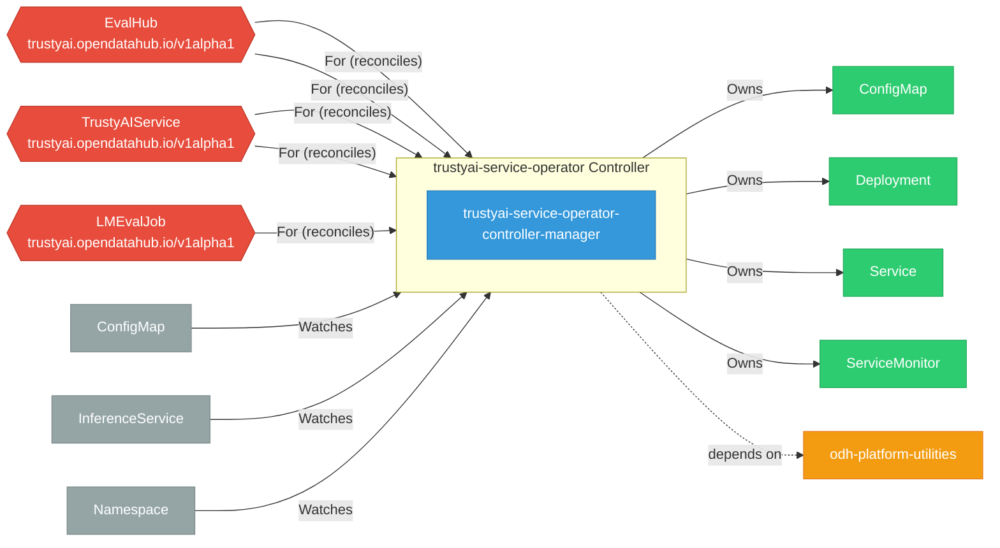

# trustyai-service-operator

> **Architecture snapshot: 2026-09-07** (2026-09-07)

**Repository:** trustyai-explainability/trustyai-service-operator  
**Analyzer:** arch-analyzer dev  
**Extracted:** 2026-09-07T03:59:05Z

## Summary

| Metric | Count |
|--------|-------|
| CRDs | 5 |
| Deployments | 1 |
| Services | 3 |
| Secrets | 1 |
| Cluster Roles | 0 |
| Controller Watches | 18 |

## Component Architecture

CRDs, controllers, and owned Kubernetes resources.

### CRDs

| Group | Version | Kind | Scope | Fields | Validation Rules | Discovery | Source |
|-------|---------|------|-------|--------|------------------|-----------|--------|
| trustyai.opendatahub.io | v1 | EvalHub | Namespaced | 19 | 0 | Go AST | [`/home/runner/work/_temp/arch-analyzer-repos/trustyai-service-operator/api/evalhub/v1/evalhub_types.go`](https://github.com/trustyai-explainability/trustyai-service-operator/blob/870559ac1034accf95ac655072444bf28d36ca19//home/runner/work/_temp/arch-analyzer-repos/trustyai-service-operator/api/evalhub/v1/evalhub_types.go) |
| trustyai.opendatahub.io | v1 | TrustyAIService | Namespaced | 19 | 0 | Go AST | [`/home/runner/work/_temp/arch-analyzer-repos/trustyai-service-operator/api/tas/v1/trustyaiservice_types.go`](https://github.com/trustyai-explainability/trustyai-service-operator/blob/870559ac1034accf95ac655072444bf28d36ca19//home/runner/work/_temp/arch-analyzer-repos/trustyai-service-operator/api/tas/v1/trustyaiservice_types.go) |
| trustyai.opendatahub.io | v1alpha1 | EvalHub | Namespaced | 19 | 0 | Go AST | [`/home/runner/work/_temp/arch-analyzer-repos/trustyai-service-operator/api/evalhub/v1alpha1/evalhub_types.go`](https://github.com/trustyai-explainability/trustyai-service-operator/blob/870559ac1034accf95ac655072444bf28d36ca19//home/runner/work/_temp/arch-analyzer-repos/trustyai-service-operator/api/evalhub/v1alpha1/evalhub_types.go) |
| trustyai.opendatahub.io | v1alpha1 | LMEvalJob | Namespaced | 19 | 0 | Go AST | [`/home/runner/work/_temp/arch-analyzer-repos/trustyai-service-operator/api/lmes/v1alpha1/lmevaljob_types.go`](https://github.com/trustyai-explainability/trustyai-service-operator/blob/870559ac1034accf95ac655072444bf28d36ca19//home/runner/work/_temp/arch-analyzer-repos/trustyai-service-operator/api/lmes/v1alpha1/lmevaljob_types.go) |
| trustyai.opendatahub.io | v1alpha1 | TrustyAIService | Namespaced | 19 | 0 | Go AST | [`/home/runner/work/_temp/arch-analyzer-repos/trustyai-service-operator/api/tas/v1alpha1/trustyaiservice_types.go`](https://github.com/trustyai-explainability/trustyai-service-operator/blob/870559ac1034accf95ac655072444bf28d36ca19//home/runner/work/_temp/arch-analyzer-repos/trustyai-service-operator/api/tas/v1alpha1/trustyaiservice_types.go) |

## Dependencies

### Internal Platform Dependencies

| Component | Interaction |
|-----------|-------------|
| odh-platform-utilities | Go module dependency: github.com/opendatahub-io/odh-platform-utilities |

### Key External Dependencies

| Module | Version |
|--------|---------|
| github.com/go-logr/logr | v1.4.4 |
| github.com/prometheus-operator/prometheus-operator/pkg/apis/monitoring | v0.64.1 |
| github.com/prometheus/client_golang | v1.24.1 |
| k8s.io/api | v0.35.3 |
| k8s.io/api | v0.34.5 |
| k8s.io/apiextensions-apiserver | v0.34.5 |
| k8s.io/apimachinery | v0.35.4 |
| k8s.io/apimachinery | v0.34.5 |
| k8s.io/client-go | v0.34.5 |
| k8s.io/client-go | v0.35.3 |
| sigs.k8s.io/controller-runtime | v0.22.5 |
| sigs.k8s.io/controller-runtime | v0.23.3 |

