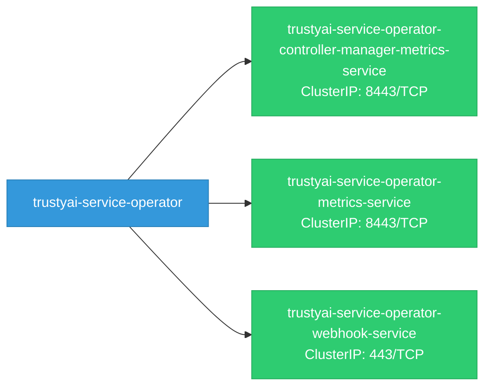

# trustyai-service-operator: Network

## Service Map

### Services

| Name | Type | Ports | Source |
|------|------|-------|--------|
| trustyai-service-operator-controller-manager-metrics-service | ClusterIP | 8443/TCP | [`kustomize:config/overlays/odh`](https://github.com/trustyai-explainability/trustyai-service-operator/blob/870559ac1034accf95ac655072444bf28d36ca19/kustomize:config/overlays/odh) |
| trustyai-service-operator-metrics-service | ClusterIP | 8443/TCP | [`kustomize:config/overlays/odh`](https://github.com/trustyai-explainability/trustyai-service-operator/blob/870559ac1034accf95ac655072444bf28d36ca19/kustomize:config/overlays/odh) |
| trustyai-service-operator-webhook-service | ClusterIP | 443/TCP | [`kustomize:config/overlays/odh`](https://github.com/trustyai-explainability/trustyai-service-operator/blob/870559ac1034accf95ac655072444bf28d36ca19/kustomize:config/overlays/odh) |

!!! warning "No Network Policies"
    No NetworkPolicy resources were found in the analyzed sources. Network policies may exist in overlays, Helm values, or cluster-level configurations not captured by static analysis.

