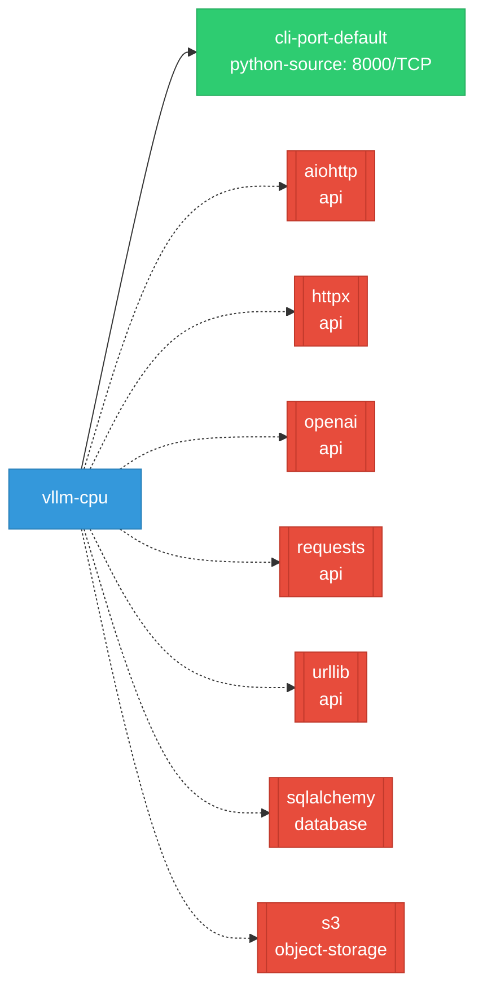

# vllm-cpu: Network

## Service Map

### Services

| Name | Type | Ports | Source |
|------|------|-------|--------|
| cli-port-default | python-source | 8000/TCP | [`benchmarks/benchmark_serving_structured_output.py:905`](https://github.com/red-hat-data-services/vllm-cpu/blob/a7f683ee6b25b07450044e5dd324a61163da3a9a/benchmarks/benchmark_serving_structured_output.py#L905) |

!!! warning "No Network Policies"
    No NetworkPolicy resources were found in the analyzed sources. Network policies may exist in overlays, Helm values, or cluster-level configurations not captured by static analysis.

