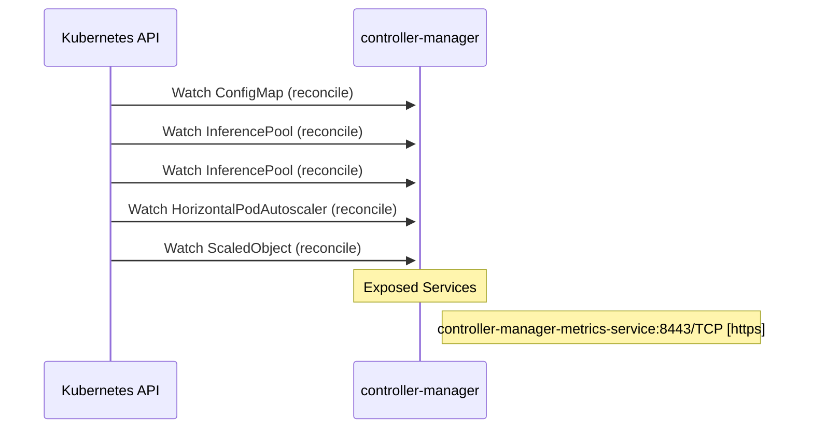

# workload-variant-autoscaler: Dataflow

## Controller Watches

Kubernetes resources this controller monitors for changes. Each watch triggers reconciliation when the watched resource is created, updated, or deleted.

| Type | GVK | Source |
|------|-----|--------|
| For | /v1/ConfigMap | [`internal/controller/configmap_reconciler.go:109`](https://github.com/llm-d/workload-variant-autoscaler/blob/f06b01abf44fcdf96383332c6f89b57a1b50bea2/internal/controller/configmap_reconciler.go#L109) |
| For | api/v1/InferencePool | [`internal/controller/inferencepool_reconciler.go:113`](https://github.com/llm-d/workload-variant-autoscaler/blob/f06b01abf44fcdf96383332c6f89b57a1b50bea2/internal/controller/inferencepool_reconciler.go#L113) |
| For | apix/v1alpha2/InferencePool | [`internal/controller/inferencepool_reconciler.go:109`](https://github.com/llm-d/workload-variant-autoscaler/blob/f06b01abf44fcdf96383332c6f89b57a1b50bea2/internal/controller/inferencepool_reconciler.go#L109) |
| For | autoscaling/v2/HorizontalPodAutoscaler | [`internal/controller/hpa_reconciler.go:67`](https://github.com/llm-d/workload-variant-autoscaler/blob/f06b01abf44fcdf96383332c6f89b57a1b50bea2/internal/controller/hpa_reconciler.go#L67) |
| For | keda/v1alpha1/ScaledObject | [`internal/controller/scaledobject_reconciler.go:68`](https://github.com/llm-d/workload-variant-autoscaler/blob/f06b01abf44fcdf96383332c6f89b57a1b50bea2/internal/controller/scaledobject_reconciler.go#L68) |

## Reconciliation Flow

How the controller interacts with the Kubernetes API during reconciliation.

## Configuration

ConfigMaps and Helm values that control this component's runtime behavior.

### ConfigMaps

| Name | Data Keys | Source |
|------|-----------|--------|
| manager-config | config.yaml | [`config/base/manager/manager-configmap.yaml`](https://github.com/llm-d/workload-variant-autoscaler/blob/f06b01abf44fcdf96383332c6f89b57a1b50bea2/config/base/manager/manager-configmap.yaml) |
| manager-config | config.yaml | [`config/components/openshift/configmap-patch.yaml`](https://github.com/llm-d/workload-variant-autoscaler/blob/f06b01abf44fcdf96383332c6f89b57a1b50bea2/config/components/openshift/configmap-patch.yaml) |
| metrics-server-ca |  | [`config/components/openshift/metrics-server-ca-configmap.yaml`](https://github.com/llm-d/workload-variant-autoscaler/blob/f06b01abf44fcdf96383332c6f89b57a1b50bea2/config/components/openshift/metrics-server-ca-configmap.yaml) |
| saturation-scaling-config | default | [`config/base/manager/saturation-scaling-configmap.yaml`](https://github.com/llm-d/workload-variant-autoscaler/blob/f06b01abf44fcdf96383332c6f89b57a1b50bea2/config/base/manager/saturation-scaling-configmap.yaml) |
| service-classes-config | freemium.yaml, premium.yaml | [`deploy/configmap-serviceclass.yaml`](https://github.com/llm-d/workload-variant-autoscaler/blob/f06b01abf44fcdf96383332c6f89b57a1b50bea2/deploy/configmap-serviceclass.yaml) |
| wva-queueing-model-config | default | [`deploy/configmap-queueing-model.yaml`](https://github.com/llm-d/workload-variant-autoscaler/blob/f06b01abf44fcdf96383332c6f89b57a1b50bea2/deploy/configmap-queueing-model.yaml) |
| wva-saturation-scaling-config | default | [`deploy/configmap-saturation-scaling.yaml`](https://github.com/llm-d/workload-variant-autoscaler/blob/f06b01abf44fcdf96383332c6f89b57a1b50bea2/deploy/configmap-saturation-scaling.yaml) |

