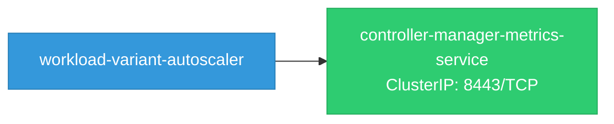

# workload-variant-autoscaler: Network

## Service Map

### Services

| Name | Type | Ports | Source |
|------|------|-------|--------|
| controller-manager-metrics-service | ClusterIP | 8443/TCP | [`legacy/config/base/manager/service.yaml`](https://github.com/red-hat-data-services/workload-variant-autoscaler/blob/af7d918a087f9db38e19120774b60b0378615662/legacy/config/base/manager/service.yaml) |

!!! warning "No Network Policies"
    No NetworkPolicy resources were found in the analyzed sources. Network policies may exist in overlays, Helm values, or cluster-level configurations not captured by static analysis.

